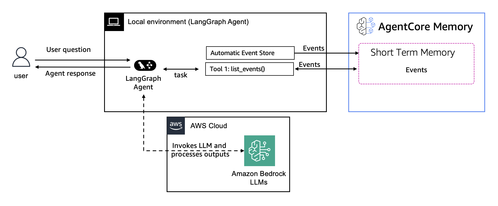

# Short-term memory — LangGraph single-agent

Three LangGraph examples that use Amazon Bedrock AgentCore Memory for **short-term**
memory — the running context of one conversation, saved and restored across turns.

Two of them use the **`AgentCoreMemorySaver` checkpointer** from
[`langgraph-checkpoint-aws`](https://pypi.org/project/langgraph-checkpoint-aws/). You hand
it to the agent once and LangGraph does the rest:

```python
from langgraph_checkpoint_aws import AgentCoreMemorySaver

checkpointer = AgentCoreMemorySaver(memory_id, region_name=region)
agent = create_react_agent(model, tools, checkpointer=checkpointer)

# Every invoke needs BOTH ids. thread_id becomes the AgentCore sessionId,
# actor_id becomes the AgentCore actorId.
config = {"configurable": {"thread_id": "session-1", "actor_id": "user-1"}}
agent.invoke({"messages": [...]}, config)
```

The third example shows the alternative: no checkpointer, memory read back through a tool.

| Example | File | Memory wiring | Complexity |
|---|---|---|---|
| **Math agent with checkpointing** | [`math-agent-with-checkpointing.py`](./math-agent-with-checkpointing.py) | **`AgentCoreMemorySaver`** (checkpointer) for automatic state persistence; multi-turn calculations that build on prior context; session isolation across `thread_id`s. | Beginner |
| **Personal fitness coach** | [`personal-fitness-coach.py`](./personal-fitness-coach.py) | **No checkpointer** — a hand-built `StateGraph` writes turns with `create_event` and reads them back through a `list_events` **tool** (memory-as-tool). | Beginner |
| **Support agent (human-in-the-loop)** | [`support-agent-human-in-the-loop.py`](./support-agent-human-in-the-loop.py) | **`AgentCoreMemorySaver`** across a pause: `interrupt` stops the graph mid-run, the paused state is saved to AgentCore Memory, and `Command(resume=...)` picks up exactly where it stopped. | Beginner |

All three use Claude Haiku 4.5 on Amazon Bedrock and require no IAM execution role
(short-term memory uses no long-term extraction strategy).

> **Not the same thing as `AgentCoreMemoryStore`.** The same package ships a second class for
> **long-term** memory, and the names are close enough to confuse: the checkpointer resumes
> *this conversation*, the store recalls facts about *this user*. They are separate arguments, not
> alternatives, and both can point at one memory resource. This folder isolates the
> checkpointer; for the comparison and for both wired together, see
> [checkpointer vs. store](../../../../00-getting-started/06-usage-patterns.md#langgraph-specifically-checkpointer-vs-store)
> and the [LTM LangGraph examples](../../../../02-long-term-memory/examples/single-agent/with-langgraph-agent/).

## Architecture

<div style="text-align:left">
    
</div>

```
  graph.stream/invoke ──▶ LangGraph agent ──▶ model (Bedrock, Claude Haiku 4.5)
          │                     │
          │ config:             │ checkpoint state per (thread_id, actor_id)
          │  thread_id=session  ▼
          │  actor_id=user   ┌─────────────────────────────────────────────┐
          └─────────────────▶│  AgentCore Memory (AgentCoreMemorySaver)     │
                             │   thread_id → session_id, actor_id → actor_id │
                             └─────────────────────────────────────────────┘
```

## Configuration: thread_id and actor_id

For the `AgentCoreMemorySaver` checkpointer, every invocation must set both identifiers in
the runtime config — this is how state is scoped and resumed:

```python
config = {
    "configurable": {
        "thread_id": "session-1",     # maps to AgentCore session_id (the conversation thread)
        "actor_id": "react-agent-1",  # maps to AgentCore actor_id (the user/agent)
    }
}
```

Using a new `thread_id` starts a fresh, isolated conversation; reusing one resumes exactly
where it left off.

> ### LangGraph API note
> These examples use `create_react_agent` from `langgraph.prebuilt` (and, in the fitness
> coach, a hand-built `StateGraph`). In **LangGraph v1.0**, `create_react_agent` is
> **deprecated** in favor of `from langchain.agents import create_agent` with the
> middleware system — it still runs but emits a deprecation warning. The
> `AgentCoreMemorySaver` checkpointer, `thread_id`/`actor_id` config, and `StateGraph` APIs
> shown here are unchanged across versions. For the current `create_agent` + middleware
> style applied to long-term memory, see the
> [LTM LangGraph examples](../../../../02-long-term-memory/examples/single-agent/with-langgraph-agent/).

## Prerequisites

- Python 3.10+
- AWS credentials with **both** AgentCore Memory permissions and Amazon Bedrock
  model-invocation permissions (resolved from the standard AWS chain).
- **Amazon Bedrock model access for Claude Haiku 4.5** in your region (request it in the
  Bedrock console under *Model access*; `us-west-2` is a safe default).

## How to run

```bash
pip install -r requirements.txt

# Optional: override the region (defaults to us-west-2)
export AWS_REGION=us-west-2

python math-agent-with-checkpointing.py
python personal-fitness-coach.py
python support-agent-human-in-the-loop.py
```

> **Note on human-in-the-loop:** `support-agent-human-in-the-loop.py` checkpoints with
> `AgentCoreMemorySaver`, including across the `interrupt()`. The saver records the pending
> `__interrupt__` write alongside the rest of the state, so the paused graph can be resumed
> from a different process or Runtime invocation than the one that paused it — you do not
> need `InMemorySaver` for interrupt/resume.

## Cleanup

Each script creates an AgentCore Memory resource (billable). The scripts end with a
commented-out `client.delete_memory_and_wait(...)` call — uncomment it to delete the
resource after a run, or delete it from the AgentCore console.

## Where to go next

- Long-term memory with LangGraph (built-in callback, custom callback, memory-as-tool):
  [`../../../../02-long-term-memory/examples/single-agent/with-langgraph-agent/`](../../../../02-long-term-memory/examples/single-agent/with-langgraph-agent/)
- The short-term memory concepts (events, sessions, actor isolation, branching):
  [`../../../README.md`](../../../README.md)
