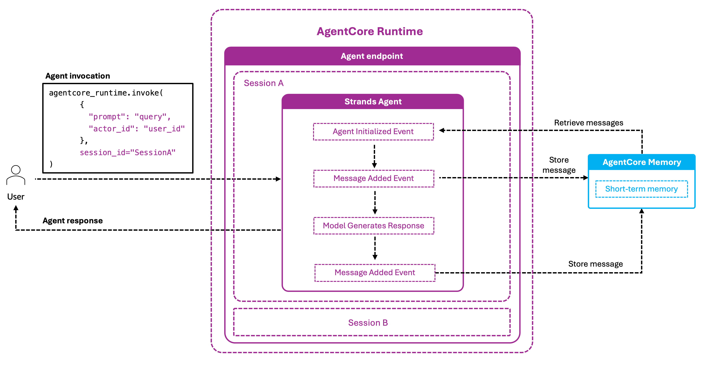

# Integrations

Composite patterns that connect AgentCore Memory to other AgentCore primitives and to Bedrock Guardrails. Each example assumes you've worked through [`../01-short-term-memory/`](../01-short-term-memory/) and [`../02-long-term-memory/`](../02-long-term-memory/) first.

| Folder | Pattern |
|---|---|
| [`01-runtime-integration/`](./01-runtime-integration/) | Memory + AgentCore runtime — agent endpoint with seamless conversation re-hydration across sessions |
| [`02-identity-integration/`](./02-identity-integration/) | Memory + AgentCore runtime + Cognito identity — per-user authentication wired into the runtime endpoint |
| [`03-guardrails-integration/`](./03-guardrails-integration/) | Memory + Bedrock Guardrails — content filters on retrieved memory and generated responses |
| [`04-memory-browser/`](./04-memory-browser/) | Web UI for inspecting memory resources, namespaces, and records |

## Runtime integration architecture



When a user invokes the agent endpoint, AgentCore runtime starts a session and runs the Strands agent. Persistence is handled by `AgentCoreMemorySessionManager` — the Strands **session manager** adapter — which fires at two points in the lifecycle:

- **Agent Initialized** — retrieve recent conversation turns from short-term memory, inject them into context before the first LLM call.
- **Message Added** — store each new user/assistant message back to short-term memory.

The agent continues a conversation seamlessly across runtime sessions: even after a session expires, the next invocation re-hydrates from memory.

Every framework has an equivalent adapter for this slot — LangGraph calls it a **checkpointer**
(`AgentCoreMemorySaver`), LlamaIndex calls it a memory (`AgentCoreMemory`). See
[06-usage-patterns.md](../00-getting-started/06-usage-patterns.md).

## Running

Each sub-folder has its own `requirements.txt` and entrypoint script:

```bash
# 01-runtime-integration/
python 01-runtime-integration/runtime_memory_integration.py

# 02-identity-integration/
python 02-identity-integration/runtime_memory_identity_integration.py

# 03-guardrails-integration/
python 03-guardrails-integration/guardrails-memory.py
```

## Where to next

- Streaming use cases (cross-region replication, personalisation, cross-customer analytics) live next to the streaming primitive: [`../02-long-term-memory/09-record-streaming/examples/`](../02-long-term-memory/09-record-streaming/examples/)
- Memory observability and CloudWatch metrics: [`../04-observability/`](../04-observability/)
- IAM, Cognito, KMS for production: [`../05-security/`](../05-security/)
