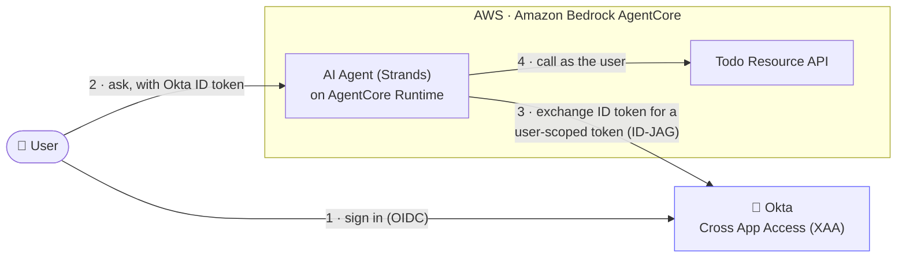
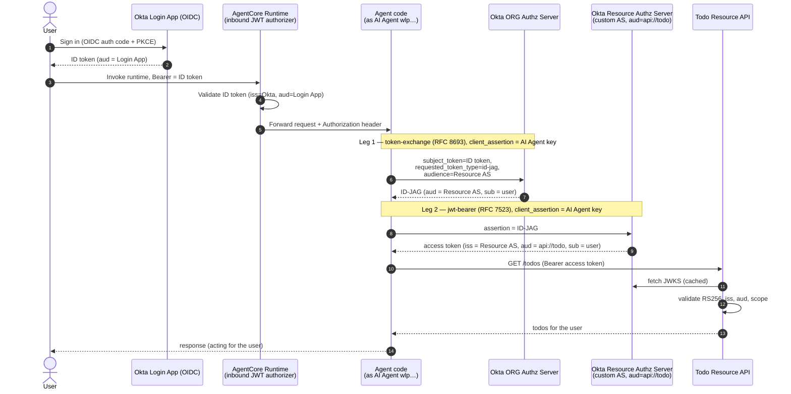
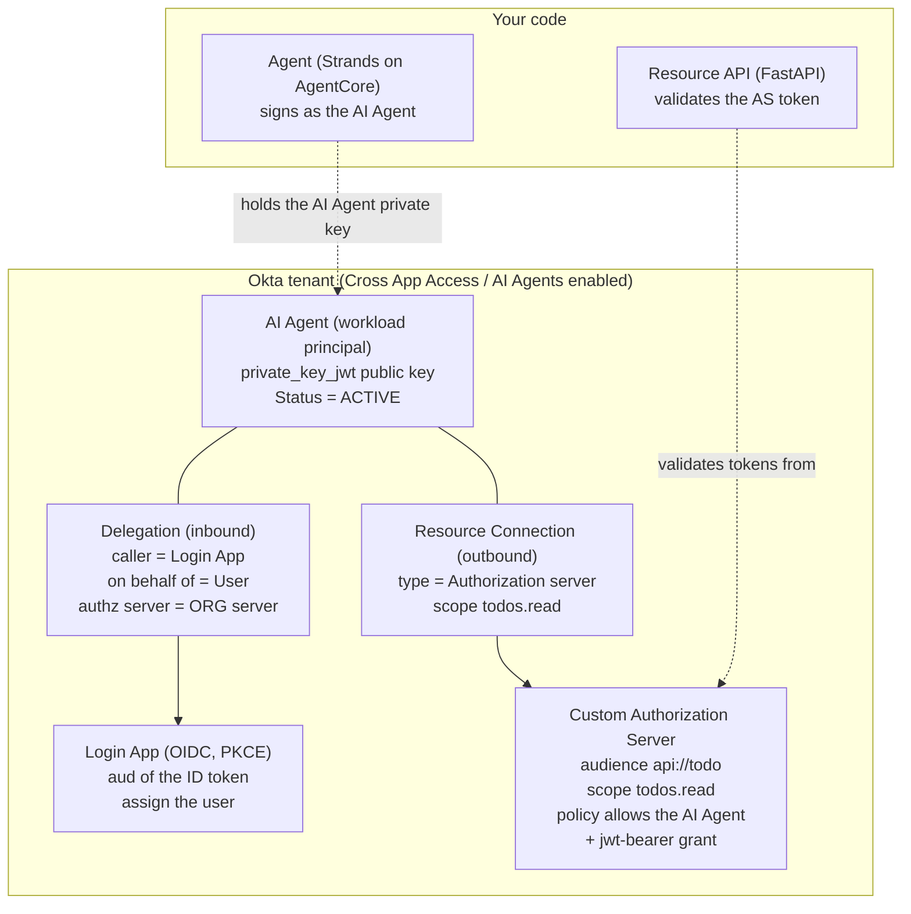

# Okta Cross App Access (XAA) + Amazon Bedrock AgentCore

A working sample where an AI agent securely calls another application's API **on
behalf of a signed-in user**, brokered by Okta using
[Cross App Access (XAA)](https://www.okta.com/solutions/cross-app-access/) — the
Identity Assertion JWT Authorization Grant (**ID-JAG**,
[draft-ietf-oauth-identity-assertion-authz-grant](https://datatracker.ietf.org/doc/html/draft-ietf-oauth-identity-assertion-authz-grant)).

- **Requesting app** — a [Strands](https://strandsagents.com) agent on **Amazon
  Bedrock AgentCore Runtime**, protected by an inbound JWT authorizer that trusts
  your Okta org. The agent is registered in Okta as an **AI Agent** (workload
  principal) and drives the token exchange itself.
- **Resource app** — a small FastAPI "todo" API, fronted by an Okta **custom
  Authorization Server** that mints the downstream access token. The API only
  *validates* that token.
- **IdP** — your Okta tenant with **Cross App Access / AI Agents** enabled.

No static API keys, no per-call consent: the user signs in once with Okta, and
the agent gets a short-lived, user-scoped token for the todo API.



*The agent acts **on behalf of the signed-in user** — every call to the todo API
carries the user's identity, brokered by Okta, with no static API keys.*

> **Model note.** This sample uses Okta's productized **AI Agents** model, where
> the resource is an Okta **custom Authorization Server** and the agent redeems
> the ID-JAG there. This was validated end-to-end against a real tenant, both
> locally and deployed to AgentCore Runtime. 

## How it works

Both token-exchange legs are performed **by the agent, authenticating as the AI
Agent** (`wlp…` id) with a single `private_key_jwt` key. Leg 1 mints the ID-JAG
at the **org** server; Leg 2 redeems it at the resource's **custom AS**. The
downstream token's `sub` is still the **user**.



### Who configures what in Okta



### Three identities to keep straight

| Identity | Env var | What it is |
| --- | --- | --- |
| **Login / caller app** | `OKTA_LOGIN_CLIENT_ID` | The OIDC app the **user signs into**. The ID token's `aud` is this client; it's what the AgentCore inbound authorizer allows. |
| **AI Agent** (both legs) | `OKTA_CLIENT_ID` | The Okta **AI Agent** (`wlp…`). Authenticates with `private_key_jwt` and performs *both* token-exchange legs. |
| **Resource authz server** | `RESOURCE_AS_ISSUER` | The Okta **custom Authorization Server** for the resource. Mints the downstream token (Leg 2); the resource API validates against its JWKS. |

## Repository layout

```
Okta-xaa/
├─ resource-app/          # Todo resource API (FastAPI) — validates the AS token
│  ├─ main.py             #   /todos protected by the Okta custom-AS access token
│  ├─ lambda_handler.py   #   Mangum wrapper to run the API on AWS Lambda
│  ├─ requirements.txt
│  └─ .env.example        #   RESOURCE_AS_ISSUER, RESOURCE_API (audience), PORT
├─ agent/                 # Requesting agent for AgentCore Runtime (Strands)
│  ├─ agent.py            #   BedrockAgentCoreApp entrypoint (reads Okta ID token)
│  ├─ xaa_client.py       #   two-leg ID-JAG exchange, as the AI Agent (wlp…)
│  ├─ todo_tools.py       #   list/add/complete tools (http or lambda call mode)
│  ├─ client_auth.py      #   private_key_jwt / client_secret client assertion
│  ├─ requirements.txt
│  └─ .env.example
├─ deploy/
│  └─ patch_agentcore_json.py  # wire the Okta CUSTOM_JWT authorizer into agentcore.json
└─ scripts/
   ├─ test_xaa_flow.py    # Milestone A: full XAA flow from the CLI
   ├─ invoke_runtime.py   # invoke the deployed runtime with a real Okta ID token
   ├─ okta_setup.py       # automate the OIDC login app + test user (Mgmt API)
   ├─ gen_keypair.py      # generate the AI Agent's private_key_jwt keypair
   ├─ cleanup.py          # tear down the AWS (+ optional Okta) resources
   ├─ client_auth.py
   ├─ requirements.txt
   └─ .env.example
```

## Prerequisites

- Python 3.11+
- An Okta tenant with **Cross App Access / AI Agents** enabled (Workforce
  Identity; the feature is often listed as *Agent to Agent Connections* under
  Settings → Features).
- For deployment: an AWS account with Bedrock model access and the AWS CLI
  configured.

## Set up a virtual environment

```bash
cd Okta-xaa
python3 -m venv .venv
source .venv/bin/activate            # macOS / Linux  (.venv\Scripts\activate on Windows)
python3 -m pip install --upgrade pip
pip3 install -r requirements.txt
```

## Generate the AI Agent's key (private_key_jwt)

The AI Agent authenticates with an asymmetric key; you register the **public**
JWK on the agent in Okta and keep the private key.

```bash
cd scripts
python3 gen_keypair.py --name okta --kid xaa-agent-okta
cd ..
```

This writes `scripts/keys/okta_private_key.pem` and
`scripts/keys/okta_public_jwk.json`.

> ⚠️ **Treat the keypair as immutable once registered.** If you re-run
> `gen_keypair.py` after registering the public key in Okta, signatures break
> (`invalid_client: client_assertion signature is invalid`). Okta won't let you
> deactivate an agent's only key or reuse a `kid`, so to rotate you must add the
> new public key under a **new `kid`**, repoint `OKTA_PRIVATE_KEY_KID`, then
> deactivate the old one.

## Okta setup (step by step)

> Use the Okta **org** authorization server (`https://<tenant>.okta.com`) for
> Leg 1 — only the org server *mints* ID-JAGs. Leg 2 happens at the resource's
> **custom** Authorization Server.

### 1. Login (caller) app — automatable

The OIDC app the user signs into. Automate it with `okta_setup.py` (needs
`OKTA_ORG_URL` + an SSWS `OKTA_API_TOKEN` in `scripts/.env`):

```bash
cd scripts
python3 okta_setup.py --auth-method none \
    --redirect-uri http://localhost:8080/callback \
    --label "XAA Login (Agent0)" \
    --create-user --user-email you@example.com     # omit --create-user to use an existing user
```

Add `--dry-run` to preview the API call. Copy the printed
`OKTA_LOGIN_CLIENT_ID`. Assign your test user to the app (the `--create-user`
path does this automatically). `--auth-method none` = public PKCE (no secret).

### 2. Resource custom Authorization Server — automatable via API

Security → API → Authorization Servers → **Add**:
- **Audience**: `api://todo` (this becomes `RESOURCE_API`).
- **Scopes**: add `todos.read` (and `todos.write` if you want writes).
- **Access Policy + Rule**: allow the **`jwt-bearer`** grant, and include the AI
  Agent's `wlp…` client id in the policy's client allowlist.
- Copy the **issuer** (`https://<tenant>.okta.com/oauth2/<as-id>`) → this is
  `RESOURCE_AS_ISSUER`.

<details>
<summary>Automate steps 2 with the Management API (curl-free, via httpx)</summary>

The Management API fully supports authorization servers, scopes, policies, and
rules (`/api/v1/authorizationServers…`): create the AS with an `audience`, add a
`todos.read` scope, then add an access policy whose rule allows the `jwt-bearer`
grant with the AI Agent's `wlp…` client id in the policy's client allowlist.
</details>

### 3. Register the AI Agent — manual (Admin Console)

Directory → **AI Agents** → **Register AI Agent** → *Register manually*:
- Name it (e.g. `XAA Todo Agent`); assign an owner.
- **Credentials**: client authentication = **Public key / Private key**; **Add
  public key** and paste `scripts/keys/okta_public_jwk.json`.
- Copy the **AI Agent ID** (`wlp…`) → `OKTA_CLIENT_ID`; note the key's **kid** →
  `OKTA_PRIVATE_KEY_KID`.
- **Delegations → Add caller**: caller = the **Login app**, on behalf of =
  **User**, **Authorization server = the org "Okta Authorization Server"** (not a
  custom AS — Leg 1 runs at the org server).
- **Resource connections → Add**: type = **Authorization server** → your custom
  AS (step 2), scope `todos.read`.
- **Actions → Activate** (the agent must be **Active**, not Staged).

## Milestone A — run the flow locally

Validates the end-to-end XAA exchange without AWS.

**1. Configure and start the resource app** (`RESOURCE_AS_ISSUER` = the custom AS
issuer, `RESOURCE_API` = its audience):

```bash
cd resource-app
cp .env.example .env        # set RESOURCE_AS_ISSUER + RESOURCE_API=api://todo
python3 main.py             # serves on http://localhost:5001
```

**2. Configure and run the test client** (second terminal, venv active):

```bash
cd scripts
cp .env.example .env        # fill Okta + resource values (see below)
python3 test_xaa_flow.py
```

Fill `scripts/.env` with: `OKTA_ISSUER`, `OKTA_LOGIN_CLIENT_ID`, `OKTA_CLIENT_ID`
(the `wlp…` agent), `RESOURCE_AS_ISSUER`, `RESOURCE_API=api://todo`,
`RESOURCE_API_URL=http://localhost:5001`, `XAA_SCOPES=todos.read`,
`CLIENT_AUTH_METHOD=private_key_jwt`, `OKTA_PRIVATE_KEY_PATH`,
`OKTA_PRIVATE_KEY_KID`.

The script opens a browser for Okta login, then prints each step:

```
Step 0 OK: id_token for you@example.com (aud=<login app>)
Step 1 OK: ID-JAG (aud=<resource AS issuer>, sub=<user>, scope=todos.read)
Step 2 OK: access token (iss=<resource AS>, aud=api://todo, sub=<user>, scp=['todos.read'])
Step 3 OK: todos returned by the resource API:
  [ ] Try Okta Cross App Access
  [ ] Wire up AgentCore Identity
XAA (ID-JAG) flow complete.
```

## Deploy the agent to AgentCore Runtime (agentcore CLI)

Deployed with the Node-based [AgentCore CLI](https://github.com/aws/agentcore-cli)
(`@aws/agentcore`, v0.25.x — *not* the deprecated `bedrock-agentcore-starter-toolkit`).
The runtime's **inbound** auth is a `CUSTOM_JWT` authorizer trusting your Okta
**org** server, with `allowedAudience` = the **login app** id (the invoking ID
token's `aud`). The agent reads the ID token from the invoke payload (`id_token`)
or the allow-listed `Authorization` header, then drives the two-leg ID-JAG
exchange as the AI Agent (`OKTA_CLIENT_ID`).

Prerequisites: Node 20+, `uv`, AWS CLI, `npm install -g @aws/agentcore aws-cdk`,
`cdk bootstrap` once per account/region, and Bedrock model access.

**1. Host the resource app** so the runtime can reach it. This sample runs it on
**AWS Lambda** (`resource-app/lambda_handler.py` wraps the FastAPI app with
Mangum). Package with **Linux** wheels and deploy:

```bash
cd resource-app
mkdir -p build && pip3 install --platform manylinux2014_x86_64 --only-binary=:all: \
  --python-version 3.12 --target build fastapi mangum "pyjwt[crypto]" pydantic python-dotenv
cp main.py lambda_handler.py build/ && (cd build && zip -qr ../function.zip .)
aws lambda create-function --function-name obo-todo-resource --runtime python3.12 \
  --handler lambda_handler.handler --role <lambda-exec-role-arn> \
  --zip-file fileb://function.zip --timeout 20 --memory-size 512 --region us-east-1 \
  --environment "Variables={RESOURCE_AS_ISSUER=<AS issuer>,RESOURCE_API=api://todo}"
```

> The agent calls this Lambda with `lambda:InvokeFunction` (see step 5,
> `RESOURCE_CALL_MODE=lambda`) — **no public Function URL required**, which also
> works in accounts whose SCPs block anonymous Function URLs. A public HTTPS
> resource works too (`RESOURCE_CALL_MODE=http` + `RESOURCE_API_URL`).

**2. Store the AI Agent private key** in Secrets Manager:

```bash
aws secretsmanager create-secret --name agentcore/xaa_private_key \
  --secret-string file://scripts/keys/okta_private_key.pem --region us-east-1
```

**3. Scaffold the project and add the agent code:**

```bash
agentcore create --project-name xaatodoagent --name xaatodoagent \
  --framework Strands --model-provider Bedrock --memory none \
  --build CodeZip --language Python --defaults
cp agent/agent.py       xaatodoagent/app/xaatodoagent/main.py
cp agent/xaa_client.py agent/todo_tools.py agent/client_auth.py xaatodoagent/app/xaatodoagent/
# add boto3, httpx, PyJWT[crypto] to app/xaatodoagent/pyproject.toml, then:
( cd xaatodoagent/app/xaatodoagent && uv lock )
```

**4. Patch `agentcore.json` for Okta inbound auth + env vars** (run from inside
the project, with your `.env` values in the environment):

```bash
cd xaatodoagent
set -a && source ../scripts/.env && set +a
# also export the runtime-only values:
export RESOURCE_CALL_MODE=lambda RESOURCE_LAMBDA_NAME=obo-todo-resource \
       XAA_KEY_SECRET_ID=agentcore/xaa_private_key AWS_REGION=us-east-1
python3 ../deploy/patch_agentcore_json.py
printf '[{"name":"default","account":"%s","region":"us-east-1"}]\n' \
  "$(aws sts get-caller-identity --query Account --output text)" > agentcore/aws-targets.json
```

**5. Deploy and grant the runtime's execution role its permissions:**

```bash
agentcore validate && agentcore deploy -y
# from `agentcore status`, note the runtime ARN and its execution role, then:
aws iam put-role-policy --role-name <exec-role> --policy-name xaa-obo-access \
  --policy-document '{"Version":"2012-10-17","Statement":[
    {"Effect":"Allow","Action":"secretsmanager:GetSecretValue","Resource":"arn:aws:secretsmanager:us-east-1:<acct>:secret:agentcore/xaa_private_key*"},
    {"Effect":"Allow","Action":"lambda:InvokeFunction","Resource":"arn:aws:lambda:us-east-1:<acct>:function:obo-todo-resource"}]}'
```

**6. Invoke** with the user's Okta ID token (both as the bearer — for the
authorizer — and in the payload, which is how the agent reads it):

```bash
# scripts/invoke_runtime.py signs the user in, then calls the runtime:
AGENT_RUNTIME_ARN=<runtime-arn> AWS_REGION=us-east-1 \
  python3 scripts/invoke_runtime.py "what is on my todo list?"
# expected: "You have 2 items on your todo list: 1. Try Okta Cross App Access ..."
```

> **Model note.** `agent.py` defaults to `us.anthropic.claude-sonnet-4-5-20250929-v1:0`
> (override with `BEDROCK_MODEL_ID`). Older Claude models may be marked *Legacy*
> and rejected by Bedrock.

## Troubleshooting (error ladder)

| Symptom | Cause | Fix |
| --- | --- | --- |
| `requested_token_type is invalid` (Leg 1) | Cross App Access / AI Agents not enabled | Enable **Agent to Agent Connections** (Settings → Features) |
| `invalid_client: client_assertion signature is invalid` | Local private key ≠ the public key registered on the agent | Register the current public JWK; treat keys as immutable (rotate via a new `kid`) |
| `invalid_client` on every call | AI Agent is **STAGED** | **Activate** the agent |
| `'subject_token' is invalid: … not registered for delegation` (Leg 1) | Delegation's authz server is a custom AS | Set the delegation's authorization server to the **org** server |
| `access_denied: Policy evaluation failed` (Leg 2) | Resource AS policy doesn't list the AI Agent | Add the `wlp…` client id to the AS policy's client allowlist |
| `invalid_grant: id-jag already used` | ID-JAGs are single-use | Mint a fresh ID-JAG per attempt (run legs back-to-back) |
| Okta app create 400 (`Invalid signOnMode` / `Missing visibility`) | OIDC app payload missing `name: oidc_client` | Fixed in `okta_setup.py` |
| Runtime → resource `403 Forbidden` on a Lambda **Function URL** | Account SCP blocks Function URLs (both `NONE` and `AWS_IAM`) | Use `RESOURCE_CALL_MODE=lambda` (agent calls the Lambda via `InvokeFunction`) instead of a Function URL |
| Bedrock `ConverseStream` … *model marked Legacy* | Hardcoded model retired | Set `BEDROCK_MODEL_ID` to an active model (e.g. `us.anthropic.claude-sonnet-4-5-20250929-v1:0`) |

## Cleanup

Tear down the resources the sample creates with `scripts/cleanup.py` (dry-run by
default; add `--yes` to actually delete):

```bash
cd scripts
python3 cleanup.py                          # preview what would be deleted
python3 cleanup.py --yes                     # delete the Lambda, secret, and lambda role
python3 cleanup.py --yes --include-runtime   # also delete the AgentCore CloudFormation stack
python3 cleanup.py --yes --include-okta       # also delete the Okta login app + custom AS
```

It reads the same `.env` values used elsewhere. The **AI Agent** (workload
principal) has no stable delete API — remove it manually in the Admin Console
(Directory → AI Agents).

## Security notes (this is a sample)

- The AI Agent's **private key** should live in AWS Secrets Manager (or an
  Okta-managed key), not on disk, in production.
- Prefer short token lifetimes and enforce MFA / step-up policy in Okta.
- The resource API validates `iss`, `aud`, and scope on every request and trusts
  only the custom AS's JWKS.
