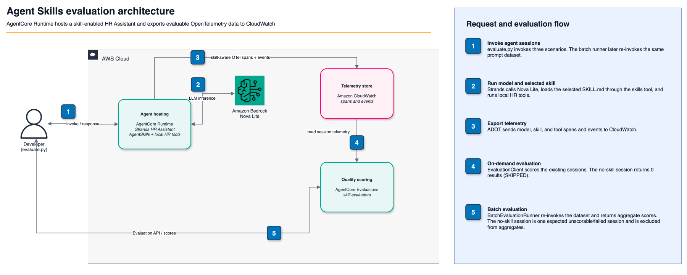

# Evaluate Agent Skills with Amazon Bedrock AgentCore

## Introduction

This sample adds [Agent Skills](https://agentskills.io/) to the evaluation suite's shared **HR Assistant** and demonstrates the two built-in Amazon Bedrock AgentCore skill evaluators:

| Evaluator | Question answered | Result scale |
|:----------|:------------------|:-------------|
| `Builtin.SkillSelectionAccuracy` | Did the agent load the best available skill for the user's request? | `Yes` (`1.0`) or `No` (`0.0`) |
| `Builtin.SkillInstructionFollowing` | After loading the skill, how completely did the agent execute its prescribed workflow? | `Fully Followed` (`1.0`), `Mostly Followed` (`0.75`), `Partially Followed` (`0.5`), `Minimally Followed` (`0.25`), or `Not Followed` (`0.0`) |

Both evaluators operate at the **tool-call level**. AgentCore emits one result per detected skill invocation and anchors it to the span that loaded the skill. The sample uses the native Strands `AgentSkills` plugin, whose `skills` tool call exposes the available skill catalog, selected skill, and loaded `SKILL.md` content in the trace.

The evaluator scores are model-generated assessments, not deterministic test assertions. Repeated runs may produce different explanations or instruction-following scores.

## Architecture



The shared HR Assistant remains unchanged for neighboring samples by default. Passing `--skills-dir` to `../utils/deploy.py` packages this folder's skills and enables `AgentSkills` only for a separate runtime whose configuration is written here.

## Skills in This Sample

### `pto-planning`

Selected for PTO balance, planning, and submission requests. Its required workflow checks the employee's balance, retrieves the PTO policy, submits only when the request is complete, and returns a structured summary.

### `benefits-advisor`

Selected for health, dental, vision, 401(k), or life-insurance questions. Its workflow retrieves the requested plan from the HR tool and reports eligibility, employee cost, coverage, and key details without inventing plan facts.

The pay-stub scenario is intentionally unrelated to either skill. It demonstrates expected **skip behavior**: when a session has no skill invocation, both evaluators return zero results.

## How the Evaluators Use the Trace

### Skill selection accuracy

`Builtin.SkillSelectionAccuracy` uses:

- `invoked_skill`: the skill loaded by the `skills` tool call
- `available_skills`: the skill catalog exposed by Strands
- `user_message`: the request that caused the invocation
- `context`: conversation turns before the skill call

It judges the selection decision only; it does not judge execution of the skill instructions.

### Skill instruction following

`Builtin.SkillInstructionFollowing` uses:

- `invoked_skill`: the loaded skill
- `skill_content`: the complete `SKILL.md` instruction body
- `context`: the full session, including actions after the skill was loaded

It identifies the required steps in `SKILL.md`, checks the recorded tool calls and response against each step, and produces an overall rating. Because it needs the full session, `evaluate.py` waits for telemetry ingestion before collecting the session records.

## Prerequisites

- Python 3.10+
- AWS CLI installed and configured with credentials for the target account and Region
- Amazon Bedrock model access for `us.amazon.nova-lite-v1:0`
- Permissions for AgentCore Runtime and Evaluations, CloudWatch Logs queries, IAM role creation and
  `iam:PassRole`, S3 bucket/object operations, STS identity lookup, and Bedrock model invocation

## Usage

Run all commands from this `skills-evaluation/` directory.

### 1. Create an environment

```bash
python3 -m venv .venv
source .venv/bin/activate
pip install -r requirements.txt
```

### 2. Deploy a separate skill-enabled HR Assistant

```bash
python ../utils/deploy.py \
  --skills-dir skills \
  --config-output agent_config.json
```

The deployment script reuses the shared HR Assistant source, packages these two skills, creates a separate AgentCore runtime, and writes its resource details to the ignored `agent_config.json` file. Omit `--region` to use the Region from your boto3 configuration.

Do not use the regular `../utils/agent_config.json` for this sample. That runtime intentionally has no skills so the existing evaluation samples retain their original tool trajectories.

### 3. Run the evaluations

```bash
python evaluate.py
```

The evaluation Region must match the Region in `agent_config.json`. Normally, omit `--region` and let the
script use the deployed runtime's Region. To use a different config or telemetry wait:

```bash
python evaluate.py --config agent_config.json --wait 300
```

The script runs in four steps:

1. Invokes three scenarios: a PTO session, a benefits session, and a no-skill control.
2. Waits for AgentCore telemetry ingestion into the unified runtime log group.
3. **EvaluationClient** — for the PTO session, extracts the skill span attributes from CloudWatch to show what each evaluator receives, then calls `EvaluationClient.run()` on each session with `Builtin.SkillSelectionAccuracy` and `Builtin.SkillInstructionFollowing`. Writes `results/eval_client_results.json`.
4. **BatchEvaluationRunner** — re-invokes all scenarios as a dataset and submits them in a single service-side batch job, returning aggregate scores per evaluator. Writes `results/batch_runner_results.json`.

> **Where are the results?** On-demand results from `EvaluationClient` are printed and saved to
> `results/eval_client_results.json`. Batch results are saved to `results/batch_runner_results.json`.
> Neither populates the CloudWatch **Evaluations** tab, which shows results from an
> [online evaluation configuration](https://docs.aws.amazon.com/bedrock-agentcore/latest/devguide/create-online-evaluations.html) associated with the endpoint.

### Test your own prompt

Run one PTO prompt instead of the three built-in scenarios:

```bash
python evaluate.py \
  --prompt "I am EMP-001. Can I take September 14 through September 16, 2026 off? Submit it using the pto-planning skill." \
  --expected-skill pto-planning \
  --wait 150
```

The script prints the agent response, waits for its telemetry, then runs both built-in evaluators. Change only the quoted prompt to try other PTO wording. Use `--expected-skill benefits-advisor` for a benefits prompt or `--expected-skill none` when the prompt should not load a skill.

## Sample Prompts

| Scenario | Prompt intent | Expected behavior |
|:---------|:--------------|:------------------|
| PTO planning | Request a PTO balance with `pto-planning` | Load `pto-planning`; check the balance and explain the PTO policy |
| Benefits advice | Request health-plan details with `benefits-advisor` | Load `benefits-advisor`; retrieve health benefit details |
| No-skill control | Retrieve an existing January 2026 pay stub | Call `get_pay_stub` directly; load no skill |

The complete prompt strings are defined in `evaluate.py` so they can be changed and rerun easily.

## Expected Output

Values and explanations vary across runs, but the four-step structure is stable:

```text
========================================================================================
HR Assistant — Agent Skills Evaluation
========================================================================================
Region  : <deployed-region>
Runtime : <agent-id>
Skills  : benefits-advisor, pto-planning

[1/4] Invoking scenarios ...

  [pto-planning] session=skill-eval-<uuid>
  Response: Based on the pto-planning skill workflow ...

  [benefits-advisor] session=skill-eval-<uuid>
  Response: Based on your health plan inquiry ...

  [no-skill-control] session=skill-eval-<uuid>
  Response: Here is your pay stub for January 2026 ...

[2/4] Waiting 150s for AgentCore telemetry ingestion ...

[3/4] EvaluationClient — per-session on-demand evaluation ...

  --- pto-planning ---

  Extracting skill span attributes (evaluator inputs) ...
  11 span records found for session skill-eval-<uuid>

  Skills tool-call event (inputs the evaluators use):
    traceId        : <trace-id>
    spanId         : <span-id>
    session.id     : skill-eval-<uuid>

  Trace-derived evaluator signals:
    invoked_skill  : pto-planning
    user_message   : 'Use the pto-planning skill. What is the available PTO balance ...'
    skill_content  : '# PTO Planning Instructions\n\nUse this skill when an employee asks ...'
    context        : (11 log records in this session span)

  Configured skill catalog (deployment context):
    - benefits-advisor: Explain an Acme employee benefit...
    - pto-planning: Check an employee's PTO balance...

  Note: Strands emits the runtime available_skills catalog natively in the trace.
        AgentCore derives the available_skills placeholder for SkillSelectionAccuracy
        service-side from those spans — not from this local catalog listing.

  pto-planning         Builtin.SkillSelectionAccuracy          1.0   Yes
  pto-planning         Builtin.SkillInstructionFollowing      1.0   Fully Followed

  --- benefits-advisor ---
  benefits-advisor     Builtin.SkillSelectionAccuracy          1.0   Yes
  benefits-advisor     Builtin.SkillInstructionFollowing      0.75  Mostly Followed

  --- no-skill-control ---
  no-skill-control     Builtin.SkillSelectionAccuracy          SKIPPED (0 results)
  no-skill-control     Builtin.SkillInstructionFollowing      SKIPPED (0 results)

  EvaluationClient results saved to: results/eval_client_results.json

[4/4] BatchEvaluationRunner — aggregate scores across all scenarios ...
  Batch name : skill_eval_<hex>
  Evaluators : ['Builtin.SkillSelectionAccuracy', 'Builtin.SkillInstructionFollowing']
  Scenarios  : 3
  Invoking agent + submitting batch (includes ingestion wait) ...

  Batch ID : <batch-evaluation-id>
  Status   : COMPLETED_WITH_ERRORS
  Sessions : 2 completed, 1 failed

  Aggregate scores per evaluator:
  Evaluator                                avg score   n
  ---------------------------------------- ----------  -
  Builtin.SkillSelectionAccuracy               1.000  2
  Builtin.SkillInstructionFollowing            0.875  2

  BatchRunner results saved to: results/batch_runner_results.json

========================================================================================
Summary
========================================================================================
  EvaluationClient results : results/eval_client_results.json
  BatchRunner results      : results/batch_runner_results.json

  Interface comparison:
    EvaluationClient      → per-session, on-demand, synchronous
    BatchEvaluationRunner → dataset-level, service-side, aggregate scores

Validation passed.
```

Instruction following can be `Partially Followed` even when skill selection is `Yes` if the agent loads the correct skill but skips a required workflow step. This distinction is why the sample runs both evaluators.

A low score is a valid evaluation result and does not fail the script. The no-skill-control session normally counts as one "failed" session in the batch job because the skill evaluators find no invocation to score; validation permits at most this one expected failure. Span-display extraction errors are reported as warnings. Missing evaluator results for an actual skill invocation, unexpected results for the control, and evaluator API errors do fail validation.

## Troubleshooting

### No `skills` span appears

- Confirm the deployment config contains `"skills_enabled": true`.
- Confirm both `skills/*/SKILL.md` files were present during deployment.
- Confirm the runtime includes `aws-opentelemetry-distro` and uses the instrumented entry point.
- Verify that the runtime log group in `agent_config.json` contains records for the generated session ID.

### Where to find the selected skill

The runtime log group contains a `gen_ai.tool.name="skills"` span for each skill invocation. Query it with the session ID printed during the run:

```text
fields @timestamp, eventName, body, traceId, spanId
| filter @message like "<session-id>"
| filter @message like /skills|skill_name/
| sort @timestamp asc
```

Look for `body.message.tool_calls[].function.arguments.skill_name` in the `gen_ai.choice` event. A subsequent `strands.telemetry.tracer` event with the same `gen_ai.tool.call.id` contains the loaded skill instructions.

### Both evaluators return zero results

The evaluators deliberately skip tool calls that do not expose `invoked_skill` or `skill_content`. Confirm that the agent called the native Strands `skills` tool and that the tool result contains the complete, well-formed `SKILL.md` file.

### Selection runs but instruction following does not

`SkillInstructionFollowing` requires the loaded `SKILL.md` body in the trace. Check that each skill has YAML frontmatter with `name` and `description`, followed by a non-empty instruction body.

## Clean Up

Read the generated resource identifiers:

```bash
python -m json.tool agent_config.json
```

Delete the AgentCore runtime first:

```bash
aws bedrock-agentcore-control delete-agent-runtime \
  --agent-runtime-id <agent_id> \
  --region <region>
```

Then remove the deployment artifacts using `s3_bucket`, `s3_key`, `role_name`, and `policy_name` from
`agent_config.json`:

```bash
aws s3 rm s3://<s3_bucket>/<s3_key>
aws iam delete-role-policy --role-name <role_name> --policy-name <policy_name>
aws iam delete-role --role-name <role_name>
rm -rf results .venv
rm agent_config.json
```

The shared regional S3 bucket is intentionally retained because other AgentCore samples may use it. The built-in evaluators are managed by AgentCore and must not be deleted.

## Additional Resources

- [Skill evaluators](https://docs.aws.amazon.com/bedrock-agentcore/latest/devguide/skill-evaluators.html)
- [On-demand evaluations](https://docs.aws.amazon.com/bedrock-agentcore/latest/devguide/evaluations-types.html)
- [Boto3 Evaluate API](https://docs.aws.amazon.com/boto3/latest/reference/services/bedrock-agentcore/client/evaluate.html)
- [Agent Skills specification](https://agentskills.io/)
