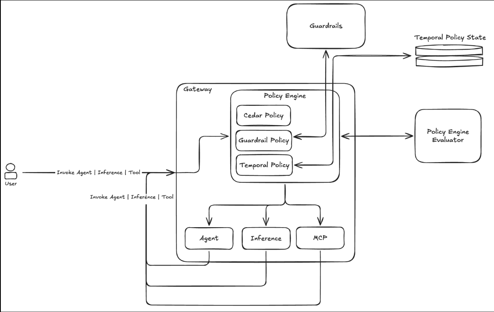

# Module 3: Temporal Policies in Amazon Bedrock AgentCore

This module introduces temporal policies: stateful authorization rules that evaluate the *history* of an agent's actions within a session, not just the current request in isolation.



## What We Already Have

Amazon Bedrock AgentCore Policy already gives you two powerful protection layers that run at the gateway perimeter, outside your agent code:

**Authorization policies** control who can call which tool and under what conditions. They are stateless Cedar rules that evaluate each request independently against the principal, action, resource, and context attributes.

> Reference: [Authorization policies: example policies](https://docs.aws.amazon.com/bedrock-agentcore/latest/devguide/example-policies.html)

**Guardrails in policies** evaluate the content of every authorized agent action (inputs and outputs), detecting prompt injection, harmful content categories, and sensitive information (PII, account numbers, etc.) using confidence-scored detection models. You set a threshold; requests above it are blocked.

> Reference: [Guardrails in policies](https://docs.aws.amazon.com/bedrock-agentcore/latest/devguide/policy-guardrails-in-policies.html)

Both layers share the same authoring surface, the same LOG_ONLY to ENFORCE calibration workflow, and the same CloudWatch observability pipeline. If you haven't worked through Modules 1 and 2, it's worth doing so before continuing; temporal policies compose with everything already in place.

## The Missing Layer: Why Temporal?

Consider three realistic scenarios with an AI agent that has access to financial tools:

**Scenario 1: Data fabrication between tool calls.** The agent calls `get_account_balance` for a customer and receives account ID `ACC-8821`. It then reasons about the result and, whether through a bug, hallucination, or a prompt-injection attack embedded in data it processed, passes account ID `ACC-3347` to `transfer_funds`. Every individual tool call looks legitimate to a stateless policy. The funds move to the wrong account.

The following temporal policy prevents this by requiring that the `toAccount` argument passed to `transfer_funds` exactly matches the `accountId` the system returned from a prior `get_account_balance` response. If the agent substitutes any other value, no `permit` matches and the transfer is denied.

```bash
permit (
    principal,
    action == AgentCore::Action::"BankingTarget___transfer_funds",
    resource == AgentCore::Gateway::"<GATEWAY_ARN>"
)
when temporal {
    formerly within 1h AgentCore::Action::"BankingTarget___get_account_balance"::response{
        eventResource:    resource,
        output.accountId: context.input.toAccount
    }
};
```

> [!IMPORTANT]
> The predicate syntax (`::response{ output.accountId: context.input.toAccount }`) is doing more than it looks like. Every field constraint simultaneously filters matching events and binds the right-hand side value against the current request. See [Predicate Anatomy and Event Recording](./docs/predicates.md) for a full explanation.

**Scenario 2: Runaway cumulative exposure.** The agent enters a loop and executes 40 trades. Each individual trade is for an amount within the authorized range. No single stateless check fires. But the cumulative exposure is catastrophic, far exceeding any risk limit a human would have approved.

The following temporal policy prevents this by summing the `amount` field across all `execute_trade` requests in the session within the last 24 hours (including the current one). Once the running total reaches $60,000, every subsequent trade is denied.

```bash
forbid (
    principal,
    action == AgentCore::Action::"TradingTarget___execute_trade",
    resource == AgentCore::Gateway::"<GATEWAY_ARN>"
)
when temporal {
    exists (total: Long).
        (sum amt for (amt: Long), (t: Timepoint).
            where (formerly within 24h (
                AgentCore::Action::"TradingTarget___execute_trade"::request{
                    eventResource: resource,
                    input.amount:  amt
                } && tp(t)
            ))) == total
        && total >= 60000
};
```

**Scenario 3: Contradictory actions in the same session.** The agent approves an insurance claim, then denies the same claim two requests later. Both actions pass their individual policy checks. The contradiction is only visible when you look at the two events together.

The following pair of temporal policies prevents this by making `approve_claim` and `deny_claim` mutually exclusive on the same `claimId` within a 5-minute window. Whichever action runs first blocks the other.

```bash
forbid (
    principal,
    action == AgentCore::Action::"ClaimsTarget___deny_claim",
    resource == AgentCore::Gateway::"<GATEWAY_ARN>"
)
when temporal {
    formerly within 5m AgentCore::Action::"ClaimsTarget___approve_claim"::request{
        eventResource:   resource,
        input.claimId:   context.input.claimId
    }
};

forbid (
    principal,
    action == AgentCore::Action::"ClaimsTarget___approve_claim",
    resource == AgentCore::Gateway::"<GATEWAY_ARN>"
)
when temporal {
    formerly within 5m AgentCore::Action::"ClaimsTarget___deny_claim"::request{
        eventResource:   resource,
        input.claimId:   context.input.claimId
    }
};
```

Two symmetric `forbid` rules are required for true mutual exclusion. A single `forbid` would block only one direction.

In all three cases, the problem is invisible to a rule that sees only the current request. It becomes visible only when you inspect the agent's *trajectory*: the ordered sequence of actions it took within a session.

Temporal policies extend AgentCore Policy with exactly this trajectory-aware enforcement layer.

## What Are Temporal Policies?

A temporal policy is a `permit` or `forbid` rule that adds a `when temporal { }` block. The block contains conditions that match against events the policy engine has recorded earlier in the same session. The current request is allowed only when all applicable `permit` conditions are satisfied and no `forbid` overrides them.

Key properties:

- **Stateful.** The engine maintains a per-session event history. Each call that passes through AgentCore Gateway is recorded. Later calls are evaluated against that accumulated record.

- **External.** Like all AgentCore policies, temporal policies run at the gateway perimeter, outside your agent's code. The agent never sees the policy logic and cannot reason around the controls, regardless of how autonomously it operates.

- **Deny-by-default.** The same model as existing policies applies: a request is denied unless a `permit` matches and no `forbid` overrides it. A temporal `permit` whose history condition is false is the same as no permit at all; the request is denied.

- **LOG_ONLY first.** You can attach a temporal policy in LOG_ONLY mode to observe what it would have decided on real traffic before switching to ENFORCE. This is the recommended calibration path, identical to guardrails.

- **Authored in Dogwood.** Temporal policies use the Dogwood policy language, an open-source superset of Cedar. Every valid Cedar policy is also valid Dogwood, so your existing policies continue to work unchanged.

> [!IMPORTANT]
> Before writing your first temporal policy, read through the [Key Concepts](./docs/advance.md) section. The predicate syntax, event recording lifecycle, and session scoping rules have non-obvious behaviors that directly affect whether your policies work as intended. For quick answers, see the [FAQ](./docs/faq.md).

## What's Next

The hands-on lab is the [Banking Assistant sample](./bankingassistant/README.md). You will deploy an AgentCore Gateway with MCP tools, attach a policy engine, and author temporal policies for each of the patterns described above, starting with sequencing and output-to-input integrity, and working through rate limiting, budget caps, and one-time-use approval.


