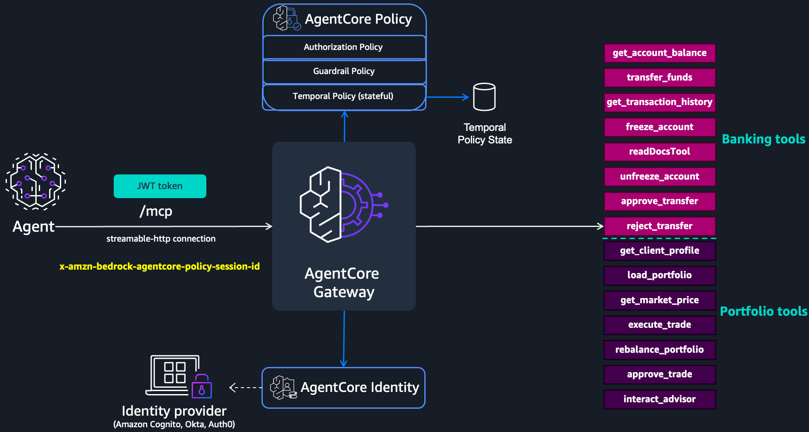

# Banking Assistant: Temporal Policies Sample

In this sample you build a banking assistant: an AI agent that can look up accounts, move money, and manage an investment portfolio on a customer's behalf. The tools live behind an MCP server deployed to AgentCore Runtime, and the agent reaches them through an AgentCore Gateway.

The catch with any agent that can take real actions is that a single tool call can look perfectly valid while the sequence of calls is dangerous: transferring to an account the agent never actually looked up, draining a balance through many small transfers, or approving and rejecting the same request seconds apart. You cannot catch these by inspecting one request in isolation; you have to look at what the agent did earlier in the session.

So instead of trying to constrain the agent from inside its own prompt (which a compromised or confused agent can ignore), you put the rules at the gateway. Every call routes through a policy engine that remembers the session history and enforces stateful, temporal rules the agent cannot bypass. The banking and portfolio tools give us concrete places to apply the core temporal policy patterns: workflow sequencing, output-to-input integrity, data freshness, session rate limiting, cumulative budget caps, one-time-use approval gates, mutual exclusion, and progressive trust decay.



### Prerequisites

- **Python 3.12+** and **uv** ([install uv](https://docs.astral.sh/uv/getting-started/installation/)) for the MCP server and setup scripts
- **Node.js 20+** and **npm** for the web app (Step 4)
- **[AgentCore CLI](https://www.npmjs.com/package/@aws/agentcore)**: `npm install -g @aws/agentcore`
- **AWS credentials** configured with permissions to create IAM and AgentCore resources, and to invoke Amazon Bedrock (the web app calls the Converse API)

Set these variables once. All commands below reference them:

```bash
export ACCOUNT_ID=$(aws sts get-caller-identity --query Account --output text)
export REGION=us-east-1
```

---

### Step 1: Amazon Cognito Setup

> [!NOTE]
> In this sample, AgentCore gateway is configured with Amazon Cognito for inbound authentication. This is done to keep the focus on AgentCore gateway patterns. For your enterprise workloads, you can configure any OAuth 2.0 compliant identity provider for inbound authentication (e.g., Entra ID, Auth0, Okta): see [identity provider setup](https://docs.aws.amazon.com/bedrock-agentcore/latest/devguide/identity-idps.html). For outbound authorization between AgentCore gateway and your targets, we recommend setting up [AgentCore gateway identity credential management](https://docs.aws.amazon.com/bedrock-agentcore/latest/devguide/what-is-bedrock-agentcore.html).

Deploy the Amazon Cognito User Pool stack:

> [!IMPORTANT]
> This Amazon Cognito stack is designed for **tutorial and testing purposes only**. MFA is disabled, the password policy is relaxed, and advanced security features are not enabled. **Do not deploy this stack to production environments without a thorough security review.** For production workloads, enable MFA, enforce a strong password policy, and configure advanced security features per your organization's requirements.

| Region | Launch |
| :--- | :--- |
| us-east-1 | [](https://console.aws.amazon.com/cloudformation/home?region=us-east-1#/stacks/new?stackName=agentcore-gateway-lab&templateURL=https://ws-assets-prod-iad-r-iad-ed304a55c2ca1aee.s3.us-east-1.amazonaws.com/015a2de4-9522-4532-b2eb-639280dc31d8/cognito-dev-stack-no-prod.yaml) |
| us-west-2 | [](https://console.aws.amazon.com/cloudformation/home?region=us-west-2#/stacks/new?stackName=agentcore-gateway-lab&templateURL=https://ws-assets-prod-iad-r-pdx-f3b3f9f1a7d6a3d0.s3.us-west-2.amazonaws.com/015a2de4-9522-4532-b2eb-639280dc31d8/cognito-dev-stack-no-prod.yaml) |

Or deploy via the CLI using the template bundled with this sample:

```bash
export COGNITO_STACK_NAME="agentcore-gateway-lab"

aws cloudformation deploy \
  --template-file cloudformation/cognito/cognito-signup-stack.yaml \
  --stack-name $COGNITO_STACK_NAME \
  --no-fail-on-empty-changeset \
  --region ${REGION}
```

Once deployed, capture the outputs you will need for later steps:

```bash
export COGNITO_STACK_NAME="agentcore-gateway-lab"

export DISCOVERY_URL=$(aws cloudformation describe-stacks \
  --stack-name $COGNITO_STACK_NAME \
  --query 'Stacks[0].Outputs[?OutputKey==`DiscoveryUrl`].OutputValue' --output text \
  --region ${REGION})

export GATEWAY_CLIENT_ID=$(aws cloudformation describe-stacks \
  --stack-name $COGNITO_STACK_NAME \
  --query 'Stacks[0].Outputs[?OutputKey==`GatewayClientId`].OutputValue' --output text \
  --region ${REGION})

export USER_POOL_ID=$(aws cloudformation describe-stacks \
  --stack-name $COGNITO_STACK_NAME \
  --query 'Stacks[0].Outputs[?OutputKey==`UserPoolId`].OutputValue' --output text \
  --region ${REGION})

export GATEWAY_CLIENT_SECRET=$(aws cognito-idp describe-user-pool-client \
  --user-pool-id $USER_POOL_ID \
  --client-id $GATEWAY_CLIENT_ID \
  --query 'UserPoolClient.ClientSecret' --output text \
  --region ${REGION})
```

### Step 2: Deploy the MCP server to AgentCore Runtime

The MCP server at `app/banking_assistant_tools/main.py` exposes all 14 tools (banking + portfolio) as a single FastMCP server. It is deployed to AgentCore Runtime, where the gateway discovers tools via `tools/list` and invokes them via `tools/call`.

#### Banking tools

| Tool | Description |
| :--- | :--- |
| `get_account_balance` | Look up an account and return its current balance, owner, and frozen status. |
| `transfer_funds` | Transfer money between two accounts. The gateway enforces that `to_account` must match the `accountId` returned by a recent `get_account_balance` call (Step 5, Policy 1). |
| `get_transaction_history` | Return recent transactions for an account, up to an optional limit. |
| `freeze_account` | Freeze an account, preventing all transfers to or from it. Accepts an optional reason. |
| `unfreeze_account` | Remove the freeze on a previously frozen account. |
| `approve_transfer` | Record a human approval for a pending high-value transfer. Required by the gateway before `transfer_funds` calls above $10,000 (Step 5, Policy 2). |
| `reject_transfer` | Record a human rejection for a pending transfer. Mutually exclusive with `approve_transfer` for the same session within 5 minutes (Step 5, Policy 5). |

#### Portfolio tools

| Tool | Description |
| :--- | :--- |
| `get_client_profile` | Retrieve a client's risk tolerance, investment policy, account restrictions, and associated portfolio IDs. |
| `load_portfolio` | Retrieve a client's portfolio holdings and current positions. |
| `get_market_price` | Fetch the current market price for a security. |
| `execute_trade` | Execute a buy or sell order against a portfolio. The gateway enforces integrity, freshness, budget cap, and approval gate policies. |
| `rebalance_portfolio` | Adjust portfolio allocations across holdings. Requires prior `load_portfolio` and a recent `interact_advisor` in the session (Step 6, Policy 6). |
| `approve_trade` | Record advisor approval for a large trade. Required by the gateway before `execute_trade` calls above $25,000. Each approval is consumed by a single trade (Step 6, Policy 3). |
| `interact_advisor` | Record an advisor interaction to reset the 15-minute trust-decay clock. Without this, the agent loses access to `rebalance_portfolio` after 15 minutes of inactivity (Step 6, Policy 6). |

Export the MCP client credentials from the Cognito stack (the MCP server uses these for inbound auth):

```bash
export MCP_CLIENT_ID=$(aws cloudformation describe-stacks \
  --stack-name $COGNITO_STACK_NAME \
  --query 'Stacks[0].Outputs[?OutputKey==`MCPClientId`].OutputValue' --output text \
  --region ${REGION})

export MCP_CLIENT_SECRET=$(aws cognito-idp describe-user-pool-client \
  --user-pool-id $USER_POOL_ID \
  --client-id $MCP_CLIENT_ID \
  --query 'UserPoolClient.ClientSecret' --output text \
  --region ${REGION})
```

Register and deploy the MCP server:

```bash
agentcore add agent \
  --name banking_assistant_tools \
  --type byo \
  --language Python \
  --protocol MCP \
  --code-location app/banking_assistant_tools \
  --authorizer-type CUSTOM_JWT \
  --discovery-url "$DISCOVERY_URL" \
  --allowed-clients "$MCP_CLIENT_ID" \
  --allowed-scopes "api/mcp" \
  --client-id "$MCP_CLIENT_ID" \
  --client-secret "$MCP_CLIENT_SECRET"

agentcore deploy --yes
```

### Step 3: Create the gateway, policy engine, and MCP server target

Run the setup script. It creates the gateway IAM role, policy engine, gateway (with the engine attached in ENFORCE mode), the MCP server target (pointing to the Runtime URL from Step 2), and the base (non-temporal) permits. The script is idempotent; re-running it safely skips resources that already exist. State is saved to `setup_config.json`.

First, export the MCP server URL and credential provider ARN from Step 2:

```bash
export MCP_SERVER_URL=$(agentcore status --json | python3 -c "
import sys, json
data, _ = json.JSONDecoder().raw_decode(sys.stdin.read().lstrip())
print(next(r['invocationUrl'] for r in data['resources'] if r['name'] == 'banking_assistant_tools'))
")

export MCP_CREDENTIAL_PROVIDER_ARN=$(agentcore status --json | python3 -c "
import sys, json
data = json.loads(sys.stdin.read())
print(data['deployedState']['targets']['default']['resources']['credentials']['banking_assistant_tools-oauth']['credentialProviderArn'])
")

echo "MCP_SERVER_URL: $MCP_SERVER_URL"
echo "MCP_CREDENTIAL_PROVIDER_ARN: $MCP_CREDENTIAL_PROVIDER_ARN"
```

Then run the setup:

```bash
uv run setup.py
```

> [!NOTE]
> AgentCore Policy is deny-by-default, so every tool that should be callable needs a plain `permit`. `setup.py` creates base permits for the read, prerequisite, and record tools (`get_account_balance`, `approve_transfer`, `get_client_profile`, `get_market_price`, `interact_advisor`, and so on). All tools are exposed under the single target name `banking-assistant-tools`. The four write tools that the workshop gates with temporal policies (`transfer_funds`, `load_portfolio`, `rebalance_portfolio`, `execute_trade`) are deliberately left without a base permit: they are authorized solely by the temporal permits you add in Steps 5 and 6. A tool with no permit is denied, and a denied action records no history for later temporal conditions to match (see `docs/predicates.md`, "The Dependency Trap").

When complete, capture the exported IDs for the policy steps:

```bash
export ENGINE_ID=$(python3 -c "import json; print(json.load(open('setup_config.json'))['engine_id'])")
export GATEWAY_ID=$(python3 -c "import json; print(json.load(open('setup_config.json'))['gateway_id'])")
export GATEWAY_ARN=$(python3 -c "import json; print(json.load(open('setup_config.json'))['gateway_arn'])")
export ENGINE_ARN=$(python3 -c "import json; print(json.load(open('setup_config.json'))['engine_arn'])")
```


### Step 4: Start the web app

The agent runs as a small web app: a Node backend (holds the Cognito token, drives the Bedrock Converse tool loop, and speaks MCP to the gateway) plus a React UI. Open a **second terminal** and start it there. Keep it running for the rest of the lab: you will chat with the agent in the browser while you add and test policies from your first terminal (Steps 5 and 6).

```bash
cd client
npm install
npm run dev
```

Then open [http://localhost:5173](http://localhost:5173).

> [!NOTE]
> The backend reads the gateway URL from `setup_config.json` automatically. Export the following in this second terminal:
> ```bash
> export REGION=us-east-1
> export COGNITO_STACK_NAME="agentcore-gateway-lab"
>
> export DISCOVERY_URL=$(aws cloudformation describe-stacks \
>   --stack-name $COGNITO_STACK_NAME \
>   --query 'Stacks[0].Outputs[?OutputKey==`DiscoveryUrl`].OutputValue' --output text \
>   --region ${REGION})
>
> export GATEWAY_CLIENT_ID=$(aws cloudformation describe-stacks \
>   --stack-name $COGNITO_STACK_NAME \
>   --query 'Stacks[0].Outputs[?OutputKey==`GatewayClientId`].OutputValue' --output text \
>   --region ${REGION})
>
> export USER_POOL_ID=$(aws cloudformation describe-stacks \
>   --stack-name $COGNITO_STACK_NAME \
>   --query 'Stacks[0].Outputs[?OutputKey==`UserPoolId`].OutputValue' --output text \
>   --region ${REGION})
>
> export GATEWAY_CLIENT_SECRET=$(aws cognito-idp describe-user-pool-client \
>   --user-pool-id $USER_POOL_ID \
>   --client-id $GATEWAY_CLIENT_ID \
>   --query 'UserPoolClient.ClientSecret' --output text \
>   --region ${REGION})
> ```

In the UI:

- Click **New Session** and pick a protocol: `2025-11-25` (handshake, via the official MCP SDK) or `2026-07-28` (stateless). Each session tracks its own transcript.
- The session header shows two IDs: the **MCP Session ID** (the transport `Mcp-Session-Id`; shown as `n/a (stateless)` for `2026-07-28`) and the **Policy Session ID** (the AgentCore temporal-policy session). The policy ID starts blank and is captured from the gateway response on the first tool call (see `../docs/sessions.md`).
- Create multiple sessions and switch between them in the sidebar to compare policy windows.

At this point only the base-permitted tools respond (the read, lookup, and record tools from Step 3). Send a few prompts to confirm the agent is wired up correctly:

```
Check the balance of ACC-1001.
Show transaction history for ACC-1001.
Get the client profile for CLIENT-001.
Get the current market price for AAPL.
```

> [!NOTE]
> The write tools that the temporal policies govern (`transfer_funds`, `load_portfolio`, `rebalance_portfolio`, `execute_trade`) have no base permit yet, so they are denied for now. That is expected: they become callable only once you add their temporal permits in Steps 5 and 6. A prompt like "Transfer $100 from ACC-1001 to ACC-2002" will be blocked at this stage.
>
> No live gateway yet? Start the app with `MOCK_MCP=1 MOCK_LLM=1 npm run dev` to explore the UI, sessions, and both protocol badges with canned data.

Once you confirm the base tools respond, keep this app running and return to your first terminal to add temporal policies in the next step.

### Step 5: Add temporal policies (banking tools)

> [!NOTE]
> These policies are additive and you create them in order, so at the moment you run each policy's test table, policies 1 through N are all active. The sample prompts are written to satisfy every earlier policy, not just the one being demonstrated. Because temporal history is per-session, run each numbered scenario in a fresh session unless the row says to continue a prior one. Ensure `${ENGINE_ID}` and `${GATEWAY_ARN}` are set from Step 3.
>
> `transfer_funds` has no base permit (see Step 3). It is authorized only by the two `permit` policies below, split by amount so they never overlap: Policy 1 handles transfers of $10,000 or less, Policy 2 handles transfers above $10,000. Every other banking policy is a `forbid` that carves exceptions out of those permits.

**Policy 1: Output-to-input integrity and freshness (transfers up to $10,000)**
Permits `transfer_funds` of $10,000 or less only when a `get_account_balance` response for the same destination account (`to_account`) occurred within the last 2 minutes. This single permit enforces two things at once: output-to-input integrity (the destination must match an account the system actually returned, blocking fabricated or injected IDs) and freshness (the lookup must be recent, not stale from earlier in the session).

<details>
<summary>Policy statement and test sequences</summary>

```cedar
permit(
  principal,
  action == AgentCore::Action::"banking-assistant-tools___transfer_funds",
  resource == AgentCore::Gateway::"<GATEWAY_ARN>"
)
when temporal {
  formerly within 2m
    AgentCore::Action::"banking-assistant-tools___get_account_balance"::response{
      eventResource: resource,
      input.account_id: context.input.to_account
    }
}
when { context.input.amount <= 10000 };
```

| # | Sample prompt | `to_account` | Expected |
| :--- | :--- | :--- | :--- |
| 1 | Check the balance of ACC-2002 | - | ALLOW |
| 2 | , then transfer $500 from ACC-1001 to ACC-2002 | ACC-2002 | ALLOW |
| 3 | Transfer $500 from ACC-1001 to ACC-9999 | ACC-9999 | DENY (destination does not match the looked-up account ACC-2002) |

</details>

```bash
aws bedrock-agentcore-control create-policy \
  --policy-engine-id ${ENGINE_ID} \
  --name transfer_integrity_freshness \
  --description "transfer_funds <= 10000 requires a get_account_balance response for the same destination within 2m" \
  --validation-mode IGNORE_ALL_FINDINGS \
  --definition "{\"policy\":{\"statement\":\"permit(principal, action == AgentCore::Action::\\\"banking-assistant-tools___transfer_funds\\\", resource == AgentCore::Gateway::\\\"${GATEWAY_ARN}\\\") when temporal { formerly within 2m AgentCore::Action::\\\"banking-assistant-tools___get_account_balance\\\"::response{ eventResource: resource, input.account_id: context.input.to_account } } when { context.input.amount <= 10000 };\"}}" \
  --region ${REGION}
```

**Policy 2: Approval gate for high-value transfers (above $10,000)**
Permits `transfer_funds` above $10,000 only when both hold: a `get_account_balance` response for the destination within 2 minutes (same integrity and freshness rule as Policy 1), and an `approve_transfer` response within 30 minutes that has not yet been consumed by a completed `transfer_funds`. Because this is the only permit for amounts above $10,000, a large transfer without a fresh, unconsumed approval has no permit and is denied.

<details>
<summary>Policy statement and test sequences</summary>

```cedar
permit(
  principal,
  action == AgentCore::Action::"banking-assistant-tools___transfer_funds",
  resource == AgentCore::Gateway::"<GATEWAY_ARN>"
)
when temporal {
  formerly within 2m
    AgentCore::Action::"banking-assistant-tools___get_account_balance"::response{
      eventResource: resource,
      input.account_id: context.input.to_account
    }
  && !AgentCore::Action::"banking-assistant-tools___transfer_funds"::response{ eventResource: resource }
     since within 30m
     AgentCore::Action::"banking-assistant-tools___approve_transfer"::response{ eventResource: resource }
}
when { context.input.amount > 10000 };
```

| # | Sample prompt | Amount | Expected |
| :--- | :--- | :--- | :--- |
| 1 | Check the balance of ACC-2002, then transfer $5,000 from ACC-1001 to ACC-2002 | $5,000 | ALLOW (Policy 1 path, at or below $10k) |
| 2 | Transfer $15,000 from ACC-1001 to ACC-2002 | $15,000 | DENY (above $10k, no approval) |
| 3 | Approve transfer REQ-001 on behalf of manager@bank.com, transfer $15,000 from ACC-1001 to ACC-2002 | $15,000 | ALLOW |

</details>

> [!IMPORTANT]
> Policy 2 uses `since` to make each approval one-time-use: once a `transfer_funds` completes (records a `::response`), the approval is consumed and the next high-value transfer requires a fresh `approve_transfer`. See [Temporal Operators](../docs/operators.md) for a full explanation of `!L since within W R`.

```bash
aws bedrock-agentcore-control create-policy \
  --policy-engine-id ${ENGINE_ID} \
  --name approval_gate \
  --description "Transfers above 10000 require a fresh destination lookup and an unconsumed approve_transfer" \
  --validation-mode IGNORE_ALL_FINDINGS \
  --definition "{\"policy\":{\"statement\":\"permit(principal, action == AgentCore::Action::\\\"banking-assistant-tools___transfer_funds\\\", resource == AgentCore::Gateway::\\\"${GATEWAY_ARN}\\\") when temporal { formerly within 2m AgentCore::Action::\\\"banking-assistant-tools___get_account_balance\\\"::response{ eventResource: resource, input.account_id: context.input.to_account } && \!AgentCore::Action::\\\"banking-assistant-tools___transfer_funds\\\"::response{ eventResource: resource } since within 30m AgentCore::Action::\\\"banking-assistant-tools___approve_transfer\\\"::response{ eventResource: resource } } when { context.input.amount > 10000 };\"}}" \
  --region ${REGION}
```

**Policy 3: Cumulative daily transfer cap**
Sums `amount` across all `transfer_funds` requests in the session within the last 24 hours. Denies once the running total reaches $60,000. This `forbid` overrides the permits above, so a transfer that Policy 1 would allow is still blocked once the session total crosses the cap.

<details>
<summary>Policy statement and test sequences</summary>

```cedar
forbid(
  principal,
  action == AgentCore::Action::"banking-assistant-tools___transfer_funds",
  resource == AgentCore::Gateway::"<GATEWAY_ARN>"
)
when temporal {
  exists (total: Long).
  (sum amt for (amt: Long), (t: Timepoint).
    where (formerly within 24h (
      AgentCore::Action::"banking-assistant-tools___transfer_funds"::request{
        eventResource: resource,
        input.amount: amt
      } && tp(t)
    ))
  ) == total && total >= 60000
};
```

Each row keeps the destination balance fresh (Policy 1) and every amount is at or below $10,000 so Policy 1 authorizes it. The rate limit (Policy 4) does not exist yet at this point, so six transfers in one session is fine. Run all six in one session so the running total accumulates.

| # | Sample prompt | Amount | Running total | Expected |
| :--- | :--- | :--- | :--- | :--- |
| 1 | Check the balance of ACC-2002, then transfer $10,000 from ACC-1001 to ACC-2002 | $10,000 | $10,000 | ALLOW |
| 2 | Re-check ACC-2002 and transfer another $10,000 from ACC-1001 to ACC-2002 | $10,000 | $20,000 | ALLOW |
| 3 | Re-check ACC-2002 and transfer another $10,000 from ACC-1001 to ACC-2002 | $10,000 | $30,000 | ALLOW |
| 4 | Re-check ACC-2002 and transfer another $10,000 from ACC-1001 to ACC-2002 | $10,000 | $40,000 | ALLOW |
| 5 | Re-check ACC-2002 and transfer another $10,000 from ACC-1001 to ACC-2002 | $10,000 | $50,000 | ALLOW |
| 6 | Re-check ACC-2002 and transfer another $10,000 from ACC-1001 to ACC-2002 | $10,000 | $60,000 | DENY (total >= $60k) |

</details>

```bash
aws bedrock-agentcore-control create-policy \
  --policy-engine-id ${ENGINE_ID} \
  --name daily_transfer_cap \
  --description "Block once cumulative transfers in the session reach 60000 in 24h" \
  --validation-mode IGNORE_ALL_FINDINGS \
  --definition "{\"policy\":{\"statement\":\"forbid(principal, action == AgentCore::Action::\\\"banking-assistant-tools___transfer_funds\\\", resource == AgentCore::Gateway::\\\"${GATEWAY_ARN}\\\") when temporal { exists (total: Long). (sum amt for (amt: Long), (t: Timepoint). where (formerly within 24h ( AgentCore::Action::\\\"banking-assistant-tools___transfer_funds\\\"::request{ eventResource: resource, input.amount: amt } && tp(t) ))) == total && total >= 60000 };\"}}" \
  --region ${REGION}
```

**Policy 4: Session rate limit**
Counts `transfer_funds` requests within the last 5 minutes. Denies the 6th and beyond in that window.

<details>
<summary>Policy statement and test sequences</summary>

```cedar
forbid(
  principal,
  action == AgentCore::Action::"banking-assistant-tools___transfer_funds",
  resource == AgentCore::Gateway::"<GATEWAY_ARN>"
)
when temporal {
  count for (t: Timepoint).
    where (formerly within 5m (
      AgentCore::Action::"banking-assistant-tools___transfer_funds"::request{
        eventResource: resource
      } && tp(t)
    )) > 5
};
```

Use small $100 amounts and a fresh session so the $60,000 cap from Policy 3 is not also in play. Each transfer still needs a fresh destination balance check (Policy 1).

| # | Sample prompt | Expected |
| :--- | :--- | :--- |
| 1 | Check ACC-2002 and transfer $100 from ACC-1001 to ACC-2002 | ALLOW |
| 2 | transfer $100 from ACC-1001 to ACC-2002 five times| ALLOW 4 transfers by 5th one DENY |

</details>

```bash
aws bedrock-agentcore-control create-policy \
  --policy-engine-id ${ENGINE_ID} \
  --name transfer_rate_limit \
  --description "At most 5 transfer_funds calls per 5-minute window" \
  --validation-mode IGNORE_ALL_FINDINGS \
  --definition "{\"policy\":{\"statement\":\"forbid(principal, action == AgentCore::Action::\\\"banking-assistant-tools___transfer_funds\\\", resource == AgentCore::Gateway::\\\"${GATEWAY_ARN}\\\") when temporal { count for (t: Timepoint). where (formerly within 5m ( AgentCore::Action::\\\"banking-assistant-tools___transfer_funds\\\"::request{ eventResource: resource } && tp(t) )) > 5 };\"}}" \
  --region ${REGION}
```

**Policy 5: Mutual exclusion (approve and reject)**
Two symmetric `forbid` rules prevent `approve_transfer` and `reject_transfer` from both occurring within 5 minutes. Whichever runs first blocks the other. These act on the `approve_transfer` and `reject_transfer` tools, which are base-permitted in Step 3, so no transfer setup is needed to test them.

<details>
<summary>Policy statements and test sequences</summary>

```cedar
// mutual_exclusion_approve
forbid(
  principal,
  action == AgentCore::Action::"banking-assistant-tools___reject_transfer",
  resource == AgentCore::Gateway::"<GATEWAY_ARN>"
)
when temporal {
  formerly within 5m
    AgentCore::Action::"banking-assistant-tools___approve_transfer"::request{ eventResource: resource }
};

// mutual_exclusion_reject
forbid(
  principal,
  action == AgentCore::Action::"banking-assistant-tools___approve_transfer",
  resource == AgentCore::Gateway::"<GATEWAY_ARN>"
)
when temporal {
  formerly within 5m
    AgentCore::Action::"banking-assistant-tools___reject_transfer"::request{ eventResource: resource }
};
```

| # | Sample prompt | Expected |
| :--- | :--- | :--- |
| 1 | **New Session** Approve transfer TRF-001 on behalf of ops@bank.com | ALLOW |
| 2 |  Reject transfer TRF-001 with reason 'changed mind'  | DENY |
| 3 | **New Session** reject TRF-002| ALLOW |
| 4 | Allow TRF-002 on behalf of ops@bank.com with valid reason| DENY |

</details>

```bash
aws bedrock-agentcore-control create-policy \
  --policy-engine-id ${ENGINE_ID} \
  --name mutual_exclusion_approve \
  --description "Cannot reject a transfer after approving one in the same 5-minute window" \
  --validation-mode IGNORE_ALL_FINDINGS \
  --definition "{\"policy\":{\"statement\":\"forbid(principal, action == AgentCore::Action::\\\"banking-assistant-tools___reject_transfer\\\", resource == AgentCore::Gateway::\\\"${GATEWAY_ARN}\\\") when temporal { formerly within 5m AgentCore::Action::\\\"banking-assistant-tools___approve_transfer\\\"::request{ eventResource: resource } };\"}}" \
  --region ${REGION}

aws bedrock-agentcore-control create-policy \
  --policy-engine-id ${ENGINE_ID} \
  --name mutual_exclusion_reject \
  --description "Cannot approve a transfer after rejecting one in the same 5-minute window" \
  --validation-mode IGNORE_ALL_FINDINGS \
  --definition "{\"policy\":{\"statement\":\"forbid(principal, action == AgentCore::Action::\\\"banking-assistant-tools___approve_transfer\\\", resource == AgentCore::Gateway::\\\"${GATEWAY_ARN}\\\") when temporal { formerly within 5m AgentCore::Action::\\\"banking-assistant-tools___reject_transfer\\\"::request{ eventResource: resource } };\"}}" \
  --region ${REGION}
```


### Step 6: Add temporal policies (portfolio tools)

> [!NOTE]
> As in Step 5, these policies are additive and created in order, so each policy's test table runs with policies 1 through N active. The prompts spell out the full prerequisite sequence (`get_client_profile` then `get_market_price` then `execute_trade`, and so on) so every row is valid against the policies in effect when you run it. All policies use the single target name `banking-assistant-tools`. Ensure `${ENGINE_ID}` and `${GATEWAY_ARN}` are set from Step 3.
>
> `load_portfolio`, `rebalance_portfolio`, and `execute_trade` have no base permit (see Step 3); they are authorized only by the temporal permits below. `execute_trade` is split by cost so its two permits never overlap: Policy 2 handles trades of $25,000 or less, Policy 3 handles trades above $25,000. Both require the same integrity and freshness prerequisites, so a trade is authorized only when every required prior step is present, not when any single one is.

**Policy 1: Workflow sequencing (load_portfolio)**

`load_portfolio` requires a prior `get_client_profile` response within 5 minutes. An agent that skips the profile step is denied regardless of its instructions. (Sequencing for `rebalance_portfolio` is handled in Policy 6, combined with trust decay.)

<details>
<summary>Policy statement and test sequences</summary>

```cedar
permit(
  principal,
  action == AgentCore::Action::"banking-assistant-tools___load_portfolio",
  resource == AgentCore::Gateway::"<GATEWAY_ARN>"
)
when temporal {
  formerly within 5m
    AgentCore::Action::"banking-assistant-tools___get_client_profile"::response{ eventResource: resource }
};
```

| # | Sample prompt | Expected |
| :--- | :--- | :--- |
| 1 | Load portfolio PORT-8821 | DENY (no prior profile) |
| 2 | Get the client profile for CLIENT-001, then load portfolio PORT-8821 | ALLOW |

</details>

```bash
aws bedrock-agentcore-control create-policy \
  --policy-engine-id ${ENGINE_ID} \
  --name portfolio_sequence_load \
  --description "load_portfolio requires prior get_client_profile within 5 minutes" \
  --validation-mode IGNORE_ALL_FINDINGS \
  --definition "{\"policy\":{\"statement\":\"permit(principal, action == AgentCore::Action::\\\"banking-assistant-tools___load_portfolio\\\", resource == AgentCore::Gateway::\\\"${GATEWAY_ARN}\\\") when temporal { formerly within 5m AgentCore::Action::\\\"banking-assistant-tools___get_client_profile\\\"::response{ eventResource: resource } };\"}}" \
  --region ${REGION}
```

**Policy 2: Trade sequencing and freshness (trades up to $25,000)**

Permits `execute_trade` of $25,000 or less only when both hold: a `get_client_profile` response within 24 hours (sequencing, ensuring the agent looked up the client before trading), and a `get_market_price` response within the last 30 seconds (freshness, blocking trades on stale quotes).

<details>
<summary>Policy statement and test sequences</summary>

```cedar
permit(
  principal,
  action == AgentCore::Action::"banking-assistant-tools___execute_trade",
  resource == AgentCore::Gateway::"<GATEWAY_ARN>"
)
when temporal {
  formerly within 24h
    AgentCore::Action::"banking-assistant-tools___get_client_profile"::response{
      eventResource: resource
    }
  && formerly within 30s
    AgentCore::Action::"banking-assistant-tools___get_market_price"::response{ eventResource: resource }
}
when { context.input.cost <= 25000 };
```

| # | Sample prompt | Expected |
| :--- | :--- | :--- |
| 1 | Get the client profile for CLIENT-001, get the market price for AAPL, then buy $15,000 of AAPL in PORT-8821 | ALLOW |
| 2 | **New Session** Get the client profile for CLIENT-001, then buy $15,000 of AAPL in PORT-8821 with no price check | DENY (no fresh market price) |

</details>

```bash
aws bedrock-agentcore-control create-policy \
  --policy-engine-id ${ENGINE_ID} \
  --name portfolio_trade_integrity_freshness \
  --description "execute_trade <= 25000 requires a client profile within 24h and a market price within 30s" \
  --validation-mode IGNORE_ALL_FINDINGS \
  --definition "{\"policy\":{\"statement\":\"permit(principal, action == AgentCore::Action::\\\"banking-assistant-tools___execute_trade\\\", resource == AgentCore::Gateway::\\\"${GATEWAY_ARN}\\\") when temporal { formerly within 24h AgentCore::Action::\\\"banking-assistant-tools___get_client_profile\\\"::response{ eventResource: resource } && formerly within 30s AgentCore::Action::\\\"banking-assistant-tools___get_market_price\\\"::response{ eventResource: resource } } when { context.input.cost <= 25000 };\"}}" \
  --region ${REGION}
```

**Policy 3: Human approval gate (trades above $25,000)**

Permits `execute_trade` above $25,000 only when the same sequencing and freshness prerequisites hold (client profile within 24h, market price within 30s) and an `approve_trade` response with status `approved` occurred within 24 hours that has not yet been consumed by a completed `execute_trade`. Because this is the only permit for trades above $25,000, a large trade without a fresh unconsumed approval has no permit and is denied.

<details>
<summary>Policy statement and test sequences</summary>

```cedar
permit(
  principal,
  action == AgentCore::Action::"banking-assistant-tools___execute_trade",
  resource == AgentCore::Gateway::"<GATEWAY_ARN>"
)
when temporal {
  formerly within 24h
    AgentCore::Action::"banking-assistant-tools___get_client_profile"::response{
      eventResource: resource
    }
  && formerly within 30s
    AgentCore::Action::"banking-assistant-tools___get_market_price"::response{ eventResource: resource }
  && !AgentCore::Action::"banking-assistant-tools___execute_trade"::response{ eventResource: resource }
     since within 24h
     AgentCore::Action::"banking-assistant-tools___approve_trade"::response{
       eventResource: resource
     }
}
when { context.input.cost > 25000 };
```

| # | Sample prompt | Trade cost | Expected |
| :--- | :--- | :--- | :--- |
| 1 | Get the client profile for CLIENT-001, get the price for AAPL, then buy $15,000 of AAPL in PORT-8821 | $15,000 | ALLOW (Policy 2 path, at or below $25k) |
| 2 | Get the profile and price, then buy $30,000 of AAPL in PORT-8821 with no approval | $30,000 | DENY (above $25k, no approval) |
| 3 | Approve trade TRD-001 via advisor by sending status "approved", get the profile and price, then buy $30,000 of AAPL in PORT-8821 | $30,000 | ALLOW |

</details>

```bash
aws bedrock-agentcore-control create-policy \
  --policy-engine-id ${ENGINE_ID} \
  --name portfolio_approval_gate \
  --description "Trades above 25000 require sequencing, freshness, and an unconsumed approve_trade" \
  --validation-mode IGNORE_ALL_FINDINGS \
  --definition "{\"policy\":{\"statement\":\"permit(principal, action == AgentCore::Action::\\\"banking-assistant-tools___execute_trade\\\", resource == AgentCore::Gateway::\\\"${GATEWAY_ARN}\\\") when temporal { formerly within 24h AgentCore::Action::\\\"banking-assistant-tools___get_client_profile\\\"::response{ eventResource: resource } && formerly within 30s AgentCore::Action::\\\"banking-assistant-tools___get_market_price\\\"::response{ eventResource: resource } && \!AgentCore::Action::\\\"banking-assistant-tools___execute_trade\\\"::response{ eventResource: resource } since within 24h AgentCore::Action::\\\"banking-assistant-tools___approve_trade\\\"::response{ input.status: \\\"approved\\\", eventResource: resource } } when { context.input.cost > 25000 };\"}}" \
  --region ${REGION}
```

**Policy 4: Cumulative budget cap**

Sums the `cost` field across all `execute_trade` requests in the session within the last 24 hours. Denies once the running total reaches $60,000. This `forbid` overrides the trade permits, so an otherwise-valid trade is blocked once the session total crosses the cap. The ALLOW and DENY outcomes below are the gateway's policy decisions on each request, evaluated before the tool executes.

<details>
<summary>Policy statement and test sequences</summary>

```cedar
forbid(
  principal,
  action == AgentCore::Action::"banking-assistant-tools___execute_trade",
  resource == AgentCore::Gateway::"<GATEWAY_ARN>"
)
when temporal {
  exists (total: Long).
  (sum amount for (amount: Long), (t: Timepoint).
    where (formerly within 24h (
      AgentCore::Action::"banking-assistant-tools___execute_trade"::request{
        eventResource: resource,
        input.cost: amount
      } && tp(t)
    ))
  ) == total && total >= 60000
};
```

Run all three in one session, each with a fresh profile and price so Policy 2 authorizes them, and each at or below $25,000 so no approval is needed.

| # | Sample prompt | Trade cost | Running total | Expected |
| :--- | :--- | :--- | :--- | :--- |
| 1 | Get the profile for CLIENT-001 and price for AAPL, then buy $20,000 of AAPL in PORT-8821 | $20,000 | $20,000 | ALLOW |
| 2 | Refresh the price, then buy another $20,000 of AAPL in PORT-8821 | $20,000 | $40,000 | ALLOW |
| 3 | Refresh the price, then buy another $20,000 of AAPL in PORT-8821 | $20,000 | $60,000 | DENY (total >= $60k) |

</details>

```bash
aws bedrock-agentcore-control create-policy \
  --policy-engine-id ${ENGINE_ID} \
  --name portfolio_budget_cap \
  --description "Total trade cost per session cannot exceed 60000 in 24h" \
  --validation-mode IGNORE_ALL_FINDINGS \
  --definition "{\"policy\":{\"statement\":\"forbid(principal, action == AgentCore::Action::\\\"banking-assistant-tools___execute_trade\\\", resource == AgentCore::Gateway::\\\"${GATEWAY_ARN}\\\") when temporal { exists (total: Long). (sum amount for (amount: Long), (t: Timepoint). where (formerly within 24h ( AgentCore::Action::\\\"banking-assistant-tools___execute_trade\\\"::request{ eventResource: resource, input.cost: amount } && tp(t) ))) == total && total >= 60000 };\"}}" \
  --region ${REGION}
```

**Policy 5: Mutual exclusion (buy then sell at a loss)**

Forbids selling a security at a loss (a `SELL` with negative `cost`) when that same security was bought within the last 5 minutes. The contradiction is the signal that something has gone wrong. As a `forbid`, it overrides the trade permits.

<details>
<summary>Policy statement and test sequences</summary>

```cedar
forbid(
  principal,
  action == AgentCore::Action::"banking-assistant-tools___execute_trade",
  resource == AgentCore::Gateway::"<GATEWAY_ARN>"
)
when temporal {
  formerly within 5m
    AgentCore::Action::"banking-assistant-tools___execute_trade"::request{
      input.symbol: context.input.symbol,
      input.action: "buy",
      eventResource: resource
    }
}
when { context.input.action == "sell" && context.input.cost < 0 };
```

Each trade below requires a fresh profile and price first (to satisfy Policy 2). Buy amounts are at or below $25,000.

| # | Sample prompt | Symbol | Cost | Time gap | Expected |
| :--- | :--- | :--- | :--- | :--- | :--- |
| 1 | Get the client profile for CLIENT-001, get the market price for AAPL, buy 10 shares of AAPL in PORT-8821 with cost 1785, then sell 10 shares of AAPL in PORT-8821 with cost -500 | AAPL | -500 | same window | DENY |
| 2 | Do the same buy setup, pause more than 5 minutes, then send "Get the market price for AAPL and sell 10 shares of AAPL in PORT-8821 with cost -500" | AAPL | -500 | > 5 min | ALLOW (buy outside 5m window) |
| 3 | Get the profile and price for AAPL, buy 10 shares of AAPL in PORT-8821 with cost 1785, then get the price for MSFT and sell 10 shares of MSFT in PORT-8821 with cost -500 | MSFT | -500 | same window | ALLOW (different symbol from buy) |
| 4 | Get the profile and price for AAPL, buy 10 shares of AAPL in PORT-8821 with cost 1785, then sell 10 shares of AAPL in PORT-8821 with cost 500 | AAPL | 500 | same window | ALLOW (cost not negative) |

</details>

```bash
aws bedrock-agentcore-control create-policy \
  --policy-engine-id ${ENGINE_ID} \
  --name portfolio_mutual_exclusion \
  --description "Cannot sell a security at a loss after buying it in the same 5-minute window" \
  --validation-mode IGNORE_ALL_FINDINGS \
  --definition "{\"policy\":{\"statement\":\"forbid(principal, action == AgentCore::Action::\\\"banking-assistant-tools___execute_trade\\\", resource == AgentCore::Gateway::\\\"${GATEWAY_ARN}\\\") when temporal { formerly within 5m AgentCore::Action::\\\"banking-assistant-tools___execute_trade\\\"::request{ input.symbol: context.input.symbol, input.action: \\\"buy\\\", eventResource: resource } } when { context.input.action == \\\"sell\\\" && context.input.cost < 0 };\"}}" \
  --region ${REGION}
```

**Policy 6: Rebalance sequencing and progressive trust decay**

Permits `rebalance_portfolio` only when a `load_portfolio` response occurred within 5 minutes (sequencing) and an `interact_advisor` response occurred within 15 minutes (trust decay). After 15 minutes without advisor engagement, rebalancing is denied until the advisor re-engages.

> [!NOTE]
> Trust decay is applied to `rebalance_portfolio` rather than `execute_trade` because `execute_trade` already requires a `get_market_price` within 30 seconds (Policies 2 and 3), so it can never run far from recent activity. `rebalance_portfolio` has no such freshness requirement, so a decay window is where it adds protection. Combining sequencing and trust decay in one permit also keeps the policy within the three-operator limit (see `docs/limits.md`).

<details>
<summary>Policy statement and test sequences</summary>

```cedar
permit(
  principal,
  action == AgentCore::Action::"banking-assistant-tools___rebalance_portfolio",
  resource == AgentCore::Gateway::"<GATEWAY_ARN>"
)
when temporal {
  formerly within 5m
    AgentCore::Action::"banking-assistant-tools___load_portfolio"::response{ eventResource: resource }
  && formerly within 15m
    AgentCore::Action::"banking-assistant-tools___interact_advisor"::response{ eventResource: resource }
};
```

| # | Sample prompt | Expected |
| :--- | :--- | :--- |
| 1 | Get the client profile for CLIENT-001, load portfolio PORT-8821, interact with advisor ADV-001, then rebalance portfolio PORT-8821 with target allocations AAPL 50% and MSFT 50% | ALLOW |
| 2 | **New Session** Get the client profile for CLIENT-001, load portfolio PORT-8821, then rebalance portfolio PORT-8821 with target allocations AAPL 50% and MSFT 50% (no advisor interaction) | DENY (no advisor within 15m) |

</details>

```bash
aws bedrock-agentcore-control create-policy \
  --policy-engine-id ${ENGINE_ID} \
  --name portfolio_rebalance_trust \
  --description "rebalance_portfolio requires load_portfolio within 5m and interact_advisor within 15m" \
  --validation-mode IGNORE_ALL_FINDINGS \
  --definition "{\"policy\":{\"statement\":\"permit(principal, action == AgentCore::Action::\\\"banking-assistant-tools___rebalance_portfolio\\\", resource == AgentCore::Gateway::\\\"${GATEWAY_ARN}\\\") when temporal { formerly within 5m AgentCore::Action::\\\"banking-assistant-tools___load_portfolio\\\"::response{ eventResource: resource } && formerly within 15m AgentCore::Action::\\\"banking-assistant-tools___interact_advisor\\\"::response{ eventResource: resource } };\"}}" \
  --region ${REGION}
```

### Cleanup

Run the cleanup script. It reads the resource IDs from `setup_config.json` and deletes every policy (base permits and temporal), the policy engine, the MCP server target, the gateway, and the gateway IAM role. The script is idempotent; resources that are already gone are skipped.

```bash
uv run cleanup.py
agentcore remove all
agentcore deploy --yes
```

Remove the MCP server from AgentCore Runtime and delete the Cognito stack (if no longer needed by other tutorials):

```bash
aws cloudformation delete-stack --stack-name ${COGNITO_STACK_NAME} --region ${REGION}
```
