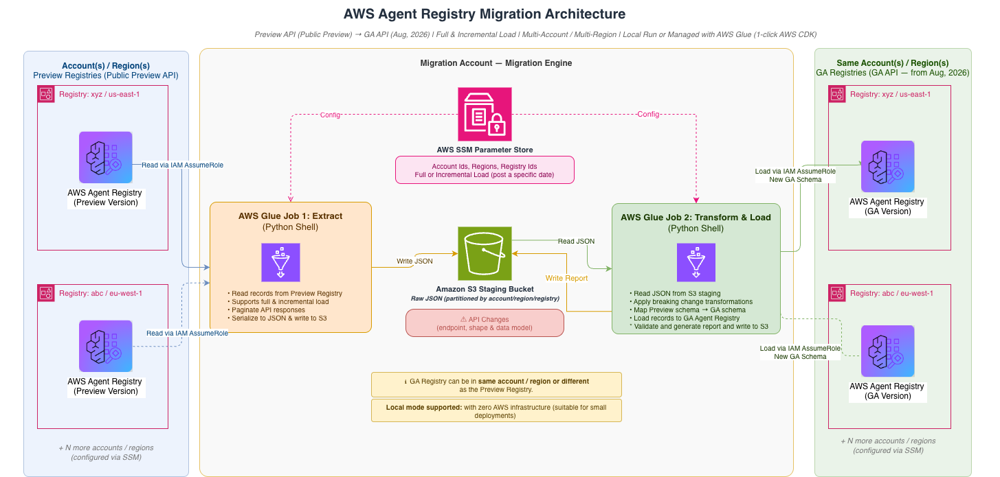

# AWS Agent Registry — migrate your data to the new version of Registry

AWS Agent Registry is releasing a new version that introduces significant changes to the service principal, data and API model. If you used AWS Agent Registry during the public preview, you must complete a migration that spans three areas.

**1. Namespace and configuration changes** – We are moving AWS Agent Registry from the AWS Bedrock AgentCore namespace into its own dedicated namespace. This namespace change applies only to AWS Agent Registry. All other AgentCore offerings—such as Identity, Gateway, Runtime, and Policy—remain unaffected. For AWS Agent Registry, the service namespace changes from `bedrock-agentcore` to `agent-registry`. This affects every surface that references the service: endpoints, IAM policies, SDK clients, CLI commands, resource ARNs, and observability integrations. You must update your code and infrastructure to use the new namespace.

**2. API schema changes** – The registry and registry record data models are updated based on customer feedback during the public preview. These changes break backward compatibility with the existing API schemas. Your application code that constructs or parses API requests and responses must be updated to reflect the new schema, as part of migrating to the new namespace.

**3. Data migration**  – You must migrate your existing registries and registry records from the old namespace to the new one. We provide migration tooling to extract your data, transform it to the new schema, and load it into the new namespace. The data is migrated to the same account and region — only the namespace changes.

> **This tool focuses on Data Migration**. Please read the detailed guide on [overall migration](https://docs.aws.amazon.com/bedrock-agentcore/latest/devguide/registry-faq.html) before starting with data migration.

This tool handles extraction of existing data, transformation from the old schema to the new schema, and loading into registries in the new namespace. It also has steps to create new registries in the agent-registry namespace within the same or different account and region. It migrates all existing records from your old registries to the new ones, accounting for namespace and API schema changes.

## Pre-requisites
- **Node.js 20+** and **Python 3.10+ with boto3 1.43.66 or newer** (`python3 -m pip install 'boto3>=1.43.66'`). Earlier releases carry no service model for the target control plane.
- **AWS credentials** with required permissions. [Permissions](docs/iam.md) has the minimum policy, copy-pasteable.
- **Registry IDs for the preview version of AWS Agent Registry**
- **[Optional] Registry IDs for the new version of AWS Agent Registry** — leave these out and `init` creates each target registry for you, from settings derived from the preview registry it replaces, and prints the generated ID.

## Install
```bash
git clone <this repo> && cd <this repo>
npm install && npm run build && npm link
export PATH="$PWD/node_modules/.bin:$PATH"
```

## Choose your migration pattern
This tool supports multiple migration patterns. Below is a quick guide on what pattern to choose.

| Migration Pattern | How it runs | Steps |
| --- | --- | --- |
| **One-time migration** — no infrastructure needed. Run locally or in CloudShell. Supports one-time full load only, no incremental loads. Scale is not a hard limit, but long-running sessions depend on your terminal staying open. | Run locally or in CloudShell. No infrastructure to deploy. | [One-time migration](#one-time-migration) |
| **Managed migration with AWS Glue** — deploys infrastructure in your AWS account. Supports both full and incremental load. Best for unattended runs, no dependency on terminal, or when you need incremental load at cutover. | Deploy Glue jobs to your account. Runs unattended. | Start with full migration and run incremental load at cutover using [Managed migration with AWS Glue](#managed-migration-with-aws-glue) |
| **Active-active migration** - you have built a platform or automation pipeline on top of the public preview APIs and are actively writing new data in production | Migrate the history with this tool, verify, dual-write to both namespaces, verify and then cutover | Start with full migration using [Managed migration with AWS Glue](#managed-migration-with-aws-glue) followed by dual-writes |

> Want to know how the tool works before you start? See the [Architecture](#architecture) section.


## One-time migration
> If your migration requires incremental loads or unattended runs, follow [Managed migration with AWS Glue](#managed-migration-with-aws-glue) instead.

> If you would like to first try a test migration on a dummy registry, follow [seeding the preview registry](docs/development.md#seeding-a-registry-for-testing).

```bash
agent-registry-migration init            # writes configurations to migration.config.json, creating target registries
agent-registry-migration check           # validates the configuration
agent-registry-migration extract         # reads everything from source and prints the run id
agent-registry-migration load --dry-run  # transforms for the target schema and generates reports
agent-registry-migration load --live     # writes to target schema
agent-registry-migration report          # review execution results
```

> Before the first `--live` load: if any record uses **Synchronize** with **IAM role** credentials, update that role's trust policy to the new service principal. `check` cannot catch this — see [Synchronized records](docs/iam.md#synchronized-records-update-the-roles-trust-policy).

That is the whole migration for most accounts. No infrastructure to deploy, no AWS CLI calls to assemble.

Reading and writing are designed to be two separate steps, with flexibility in mind. If something breaks while writing, you can modify the extracted files manually as well.

---
## Managed migration with AWS Glue

This migration pattern is best suited in any of below cases:
- You would not want to rely on your laptop staying awake
- You plan to run both registry versions in parallel and need an incremental load later on

**Estimated cost**: most migrations cost well under $1 in Glue and S3 charges. See [Infrastructure cost](docs/detaileddoc.md#infrastructure-cost-for-managed-migration-with-aws-glue) for a full breakdown. After cutover, remember to [clean up](#clean-up-for-managed-migration-with-aws-glue) — the S3 staging bucket continues to incur storage charges until removed.

### Deploy
```bash
agent-registry-migration init                  # writes configurations to migration.config.json, creating target registries
agent-registry-migration check                 # validates the configuration
agent-registry-migration deploy                # CDK stack: S3 bucket, 2 Glue jobs, config in SSM parameter store
```
### If you need to do a full run (needed for the first time)
```bash
agent-registry-migration extract --glue        # starts the extract job and waits, staging in the bucket
agent-registry-migration load --glue --dry-run # starts the load job in dry-run mode
agent-registry-migration load --glue --live    # starts it for real, creating the target records
agent-registry-migration report --glue         # reads the reports out of the deployed bucket
```

> Before the first `--live` load: if any record uses **Synchronize** with **IAM role** credentials, update that role's trust policy to the new service principal. `check` cannot catch this — see [Synchronized records](docs/iam.md#synchronized-records-update-the-roles-trust-policy).

### If you need to do an incremental run (after the full run, at the time of cutover or in between)
```bash
agent-registry-migration extract --glue --incremental
agent-registry-migration load --glue --live 
agent-registry-migration report --glue
```

### If you need to do an incremental run with your own checkpoint (after the full run, at the time of cutover or in between)
```bash
agent-registry-migration extract --glue --incremental --since 2026-08-01T00:00:00Z
agent-registry-migration load --glue --live 
agent-registry-migration report --glue
```

## Reports generated

The tool generates various reports to give you a detailed view of migration run. In most cases, the HTML report is all you need as it contains the overall status (record counts by status, success and failure summary) as well as logs for failed records. But there are other reports available in JSON format for detailed review.

Reports are organised to keep complete track of all the extracts runs (**run-id**) and load attempts (**attempt-id**).

```
reports/run_id=<run-id>/
  extract-summary.json                              what extraction read
  extracted-records/mapping=<id>/part-*.json        every preview record, as described
  attempt=<attempt-id>/
    summary.html                                    the report as a page: every check, already answered
    summary.json                                    summary report
    id-crosswalk/mapping=<id>.csv                   old recordId -> new recordId
    record-comparison/mapping=<id>/part-*.json      per record: preview, transformed, target
    failures/mapping=<id>.json                      only present when something failed
```

## If something fails

Nothing is written to the target registry without `--live`, and every run is idempotent, so re-running the same command is safe — it skips whatever already succeeded and retries only what didn't. Clear the cause below, then re-run.

`agent-registry-migration report` shows per-mapping counts and a status of `SUCCEEDED`, `PARTIAL_SUCCESS` or `FAILED`, with each failed record and its error under `failures/` above.

| What you're seeing | Error | Fix |
| --- | --- | --- |
| No config file yet | `No configuration at <path>` | Run `init`, or pass `--config <path>` |
| `check` found problems | `Pre-flight validation FAILED (N problem(s))` | Each `[FAIL]` line carries its own `fix:` |
| It can't read the preview registry | `AccessDeniedException` | Grant the source `bedrock-agentcore` read permissions — see [Permissions](docs/iam.md) |
| The run stopped partway | status `PARTIAL_SUCCESS` or `FAILED` | `load --live --run-id <run-id>` |
| Two target records look like the same source record | `target registry holds multiple records with the same descriptor source identity` | Delete the redundant target record |
| A record is broken in the target registry, even after a clean run | `Existing target record <id> is in failure status CREATE_FAILED: <reason>` | Delete the record — a re-run alone will not overwrite a failure status. Usually a [Synchronize trust policy](docs/iam.md#synchronized-records-update-the-roles-trust-policy) still naming the preview principal |

**One catch if you fix a record outside this tool:** touch it so its update timestamp moves. Incremental extracts select by update time, so otherwise the re-run sees it as unchanged and skips it.

## Verifying the migration

While migration reports give you a good view to determine the state of migration and failures (if any), it is strongly recommended to verify the target registry before you decide to cutover. Some of the verification checks are given below for reference.

| Verification check | Procedure |
| --- | --- |
| Every registry exists in the new namespace | Run `list-registries`. The count must match your preview registries. |
| Record counts match, per registry | Run `list-registry-records --registry-id <new-registry-id>` and compare against the per-registry count in the extract report. |
| Records have the correct type | Run `list-registry-records --filters '[{"name":"recordType","values":["MCP"]}]'`. Counts must match the extract report's `recordTypeCounts`, accounting for the `A2A`→`AGENT` and `AGENT_SKILLS`→`SKILL` renames and any failures. |
| Descriptor tree matches the new model | Run `get-registry-record`. Confirm exactly one primary key, valid for the `recordType`; leaf nodes carrying `data` and `dataSchemaVersion`; supplementary descriptors under `additionalData`; and no surviving `inlineContent`, `schemaVersion`, or `descriptorType` fields. |
| Descriptor content is preserved | Compare `descriptors.<primary>.data` against the preview `inlineContent`. The values must be byte-identical. |
| `source` field is correctly placed | Verify `source` is on the descriptor (not the record), and only on `mcpServer`, `a2aAgentCard`, and the `skillMd` child. `tools` and `custom` descriptors carry no `source`. |
| Approval statuses are preserved | Run `list-registry-records --filters '[{"name":"status","values":["APPROVED"]}]'`. The count must match `approval.targetStatusCounts` in the load report. |
| Records are usable, not just present | Read an approved record from the data plane using `list-discoverable-registry-records` and then `batch-get-discoverable-registry-record`. Records in `DRAFT` status are not returned by data-plane APIs by design. |
| Applications can use the new namespace | Update your endpoints, IAM policies, and SDK clients, then perform a read and a write. This step is outside the scope of the migration tool. |


## Clean up for managed migration with AWS Glue

```bash
agent-registry-migration destroy                     # prints what would go and what would survive
agent-registry-migration destroy --yes               # deletes the stack, keeps every staged file
agent-registry-migration destroy --yes --delete-data # also empties and deletes the staging bucket
agent-registry-migration destroy --yes --delete-data --keep-reports  # ...but keeps the reports
```

## Limitations

- **Registry Record IDs are different in public preview and target registry**: Registry Record Id is an auto generated field, hence migration tool is not able to retain the values same as your public preview registry. The tool does generate a crosswalk report (**id-crosswalk/mapping=<id>.csv**) to give you the mapping between old and new record ids.
- **Dual Writes**: If you have custom layer (UI, Approval workflow or CI/CD pipeline etc.) written on top of AWS Agent Registry and decide to do dual writes in parallel phase, then we don't recommend running the incremental run at the time of cutover as it may introduce some data inconsistencies.

## Architecture


Simplified version:

```
                    ┌──────── your machine, or the deployed Glue jobs ────────┐
                    │                                                        │
Preview registry ──▶│  1. extract          2. transform + load               │──▶ target registry
  (read-only)       │     records to           staged records to target      │      (records
                    │     staging              only when --live              │       created)
                    └──────────┬──────────────────────────┬──────────────────┘
                               ▼                          ▼
                        runs/…/raw/                 reports/…/
                        immutable JSONL             what was read, what was written,
                        + manifest                  old → new crosswalk, failures
```

## Additional documentation

| Document | What is in it |
| --- | --- |
| [Permissions](docs/iam.md) | The minimum IAM policy for each thing you might do: running the migration, creating the target registries, deploying the engine, supplying the engine's role yourself, and reaching another account |
| [Configuration reference](docs/configuration.md) | Every setting, its default, and what it changes |
| [Working on the tool](docs/development.md) | Layout, the test gate, seeding dummy registries with some records, throughput, and the SDK the service models come from |
| [Detailed operational guide](docs/detaileddoc.md) | A detailed operational guide covering how the migration tool works — what it changes, available commands, reporting, incremental runs, multi-account support, and troubleshooting. |

[Migrating AWS Agent Registry from the public preview to the new
version](https://docs.aws.amazon.com/bedrock-agentcore/latest/devguide/registry-faq.html).