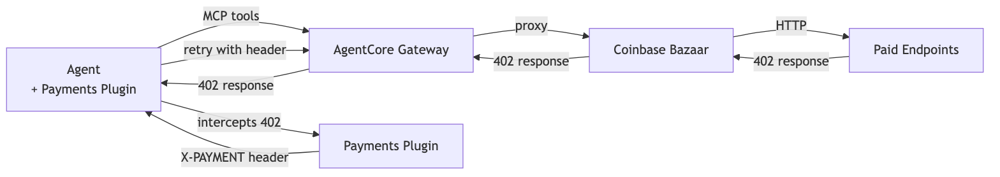

# Tutorial 04 — Agent with Coinbase Bazaar via AgentCore Gateway

| Information         | Details                                                                          |
|:--------------------|:---------------------------------------------------------------------------------|
| Tutorial type       | Feature integration                                                              |
| Agent type          | Single, discovery-driven                                                         |
| Agentic Framework   | Strands Agents                                                                   |
| LLM model           | Anthropic Claude Sonnet 4.6 (`us.anthropic.claude-sonnet-4-6`)                   |
| Components          | AgentCore Gateway (MCP target), Coinbase x402 Bazaar, `AgentCorePaymentsPlugin`  |
| Example complexity  | Intermediate                                                                     |

> **Reads** the shared `.env` from Tutorial 00 (`PAYMENT_MANAGER_ARN`, `USER_ID`, `INSTRUMENT_ID`)
> plus `GATEWAY_URL`, and `AWS_REGION` (default `us-west-2`). **Does** — provisions an AgentCore
> Gateway fronting the Coinbase x402 Bazaar with the CLI, then runs a Strands agent that discovers
> and pays for Bazaar tools with the SDK. → [How the pieces fit together](../README.md#cli-vs-sdk)

## Overview

The **Coinbase x402 Bazaar** is an MCP marketplace where paid tools are listed with semantic
descriptions, pricing, and input/output schemas. In this tutorial you use the **AgentCore CLI** to
provision one shared piece of infrastructure — a Gateway named `BazaarGateway` with a target named
`CoinbaseBazaar` that fronts the Bazaar's MCP endpoint — and return its Gateway URL. Then your agent
backend uses the **AgentCore SDK** (`PaymentManager`) to create a per-request spending session and
run a Strands agent that discovers tools at runtime via `search_resources` and calls (and pays for)
them via `proxy_tool_call`. The payment manager, connector, and instrument all come from Tutorial 00.

The step forward from Tutorial 01 is discovery: the agent doesn't know which
URLs to call. It searches the Bazaar, picks a tool, and the `AgentCorePaymentsPlugin` handles the 402
automatically.

> **Billable resources.** `agentcore deploy` creates a real AgentCore Gateway (billed per request +
> data transfer). See [AgentCore pricing](https://aws.amazon.com/bedrock/agentcore/pricing/). Run
> Clean Up when finished.

> **Testnet only.** Uses Base Sepolia (`network ETHEREUM`) with free USDC from
> [faucet.circle.com](https://faucet.circle.com/). Testnet USDC has no monetary value.

> **Supported regions:** `us-east-1`, `us-west-2`, `eu-central-1`, `ap-southeast-2`. Use the same
> region as your Tutorial 00 stack.

## Architecture



```
Developer Code
  Strands Agent
  + AgentCorePaymentsPlugin
  + MCPClient (streamable HTTP)
       │ MCP protocol
  AgentCore Gateway
  Target: Coinbase x402 Bazaar
       │
  Coinbase x402 Bazaar
  search_resources → discover
  proxy_tool_call  → call + pay
       │ HTTP 402 → pay → retry
  AgentCore payments
  PaymentManager → ProcessPayment (sign + proof)
```

`bazaar_gateway_agent.py` connects to the Gateway with the MCP streamable-HTTP transport, lists the
Bazaar tools, and hands them to a Strands agent with an `AgentCorePaymentsPlugin`. The plugin
intercepts any 402 the Bazaar surfaces, signs the payment, and retries — no payment code in the agent
loop. It is **wallet-agnostic**: the same code works whether Tutorial 00 configured Coinbase CDP or
Stripe/Privy, because AgentCore payments resolves the wallet provider from the instrument's
PaymentConnector. Only the `.env` values differ.

## Prerequisites

- **Tutorial 00 completed** — the shared `.env` (one directory up, `00-getting-started/.env`) is
  populated with `PAYMENT_MANAGER_ARN`, `USER_ID`, `INSTRUMENT_ID`, and region.
- **Funded wallet with delegated signing** — the instrument must be `ACTIVE` (funded with testnet
  USDC and delegated-signing granted in Tutorial 00 or Tutorial 03). The script asserts this.
- **AgentCore CLI** (this tutorial provisions the Gateway with it): `npm install -g @aws/agentcore`
  (Node.js 20+).
- **AWS CLI configured**: `aws sts get-caller-identity`.
- **Region** — the SDK reads the region from the `AWS_REGION` env var (default `us-west-2`). Set
  `AWS_REGION` (in your shell or the shared `.env`) to your Tutorial 00 stack region so
  `PaymentManager` targets the right one.
- **Python deps**:
  ```bash
  pip install -r requirements.txt
  ```

## Walkthrough

### Step 1 — Provision the Gateway + Bazaar target with the CLI

Scaffold a small project to hold the Gateway, add the Gateway and the Coinbase x402 Bazaar as an
`mcp-server` target, deploy, then fetch the Gateway URL and auth. Run these from this tutorial folder;
`agentcore create` drops you into a new `BazaarAgent/` project directory.

```bash
# Scaffold a project to hold the Gateway
agentcore create --name BazaarAgent --framework Strands --protocol HTTP --model-provider Bedrock --memory none
cd BazaarAgent

# Add the Gateway and the Coinbase x402 Bazaar as an mcp-server target
agentcore add gateway --name BazaarGateway
agentcore add gateway-target \
  --name CoinbaseBazaar \
  --type mcp-server \
  --endpoint https://api.cdp.coinbase.com/platform/v2/x402/discovery/mcp \
  --gateway BazaarGateway

# Deploy the Gateway, then fetch its URL + auth
agentcore deploy -y
agentcore fetch access --name BazaarGateway --type gateway
```

The `fetch access` output includes the Gateway URL you'll use in Step 2. For a `CUSTOM_JWT`
gateway it also prints a ready-to-use bearer token (and its expiry); the `CLIENT_ID`,
`CLIENT_SECRET`, and `TOKEN_URL` the scripts need in Step 2 come from your OIDC provider, not from
`fetch access` — see the note below.

> **Enabling `CUSTOM_JWT` inbound auth (optional; the more secure choice for anything beyond local
> experimentation).** The Gateway defaults to `NONE` inbound auth. To require a JWT instead, supply
> an **existing** OIDC issuer when you add the gateway — the CLI does **not** create an identity
> provider for you:
> ```bash
> agentcore add gateway --name BazaarGateway \
>   --protocol-type MCP \
>   --authorizer-type CUSTOM_JWT \
>   --discovery-url https://<issuer>/.well-known/openid-configuration \
>   --allowed-clients <client-id> \
>   --client-id <client-id> --client-secret <client-secret>
> ```
> Any OIDC provider works — for example an Amazon Cognito user pool with a machine-to-machine
> (`client_credentials`) app client. Use that provider's values for `CLIENT_ID`, `CLIENT_SECRET`,
> and `TOKEN_URL` in Step 2; the scripts auto-detect them and attach the bearer token. (The
> `--client-id`/`--client-secret` passed here let the CLI mint tokens for `fetch access`.)

> **Prefer the Console?** Gateway → Create Gateway → Add Target → target type **Integrations** →
> **Coinbase x402 Bazaar** (no outbound auth needed) configures the same Bazaar MCP server — the
> result is equivalent to the CLI path above.

### Step 2 — Put the Gateway URL in `.env`

Take the URL from `agentcore fetch access` and add it to the shared `.env`
(`00-getting-started/.env`):

```
GATEWAY_URL=https://<gateway-id>.gateway.bedrock-agentcore.<region>.amazonaws.com/mcp
```

If your Gateway uses `CUSTOM_JWT` inbound auth, also add `CLIENT_ID`, `CLIENT_SECRET`, and
`TOKEN_URL` from your OIDC provider (the identity provider you configured in Step 1). If it uses
`NONE` auth (the default), leave them unset — the script auto-detects which to use.

### Step 3 — Run the discovery-driven agent

```bash
python bazaar_gateway_agent.py
```

The script verifies the Tutorial 00 instrument is `ACTIVE`, **creates a $1.00 / 60-min spending
session in-code with the SDK** (`manager.create_payment_session(...)`), connects to the Gateway over
MCP, and lets the agent discover and pay for Bazaar tools — every payment draws down the session
budget, and the `AgentCorePaymentsPlugin` handles each 402 automatically.

## What the agent does

`bazaar_gateway_agent.py`, in order:

1. **Verifies AWS credentials** and loads the shared `.env` via `utils.load_tutorial_env()`, which
   derives the region from the `AWS_REGION` env var (default `us-west-2`).
2. **Checks the instrument** is `ACTIVE` (funded + delegated) and **creates a $1.00 payment session**
   with the SDK.
3. **Connects to the Gateway** over MCP streamable HTTP (auto-detecting `NONE` vs `CUSTOM_JWT` auth)
   and builds a Strands agent with the Bazaar tools + `AgentCorePaymentsPlugin`.
4. Runs five discovery scenarios: discover-and-call a paid tool, compare prices across categories,
   make a budget-aware selection under $0.10, chain multiple paid calls in one session, and verify
   the Bazaar's curation layer is active (`curatedOnly` search — no payment).
5. **Prints session spend** (budget, remaining, spent) and a CloudWatch traces link.

The discover → call → 402 → pay → retry sequence across the Gateway and Bazaar looks like this:


## Inspect / verify

- Confirm the Gateway deployed: `agentcore status` (run from the `BazaarAgent/` project dir created in
  Step 1).
- Inspect payment resources: `agentcore status --type payment` (from the same project dir).
- Confirm `.env` has `GATEWAY_URL` set (and `CLIENT_ID`/`CLIENT_SECRET`/`TOKEN_URL` if `CUSTOM_JWT`).
- The script itself prints per-session spend and remaining budget after the Bazaar calls.

### Verify the Bazaar target through the Gateway (no payment)

Confirm the three Bazaar tools are discoverable and that Coinbase's **curation** layer is active —
neither requires a funded wallet.

```bash
# Confirm curation is enabled and the curatedOnly filter is honored (read-only, no payment).
# Reports curated vs. uncurated coverage and a category breakdown.
python validate_bazaar_curation.py
```

The three tools are exposed under the target-name prefix `CoinbaseBazaar___` —
`CoinbaseBazaar___search_resources`, `CoinbaseBazaar___proxy_tool_call`, and
`CoinbaseBazaar___validate_endpoint`. `validate_bazaar_curation.py` lists them at the top of its
output as a quick health check.

> **On "how many curated endpoints?"** `search_resources` returns at most 20 results per call, sets
> `partialResults=true` when more match, and has **no offset/cursor** — so the full catalog can't be
> enumerated through the API. The script reports the distinct curated endpoints it discovered across
> a set of probe queries as a **lower bound**, and proves curation is working by showing the
> `curatedOnly` filter excludes non-curated resources — it does not assert an exact count.

Optionally, check whether an x402 URL is Bazaar-ready (read-only diagnostics, no payment):

```bash
python validate_endpoint_example.py https://api.example.com/your-endpoint GET
```

## Troubleshooting

| Symptom | Cause | Fix |
|---|---|---|
| `GATEWAY_URL not set in .env` | Gateway URL missing | Complete Step 1, then add `GATEWAY_URL=<url>` to the shared `.env` (Step 2) |
| `agentcore: command not found` | AgentCore CLI not installed | `npm install -g @aws/agentcore` |
| MCP connection fails / 401 / 403 | Gateway not deployed, or wrong/missing auth | `agentcore status` to confirm deploy; for `CUSTOM_JWT`, set `CLIENT_ID`/`CLIENT_SECRET`/`TOKEN_URL` from your OIDC provider (README Step 1) |
| `ModuleNotFoundError: No module named 'requests'` | Older install predating the `requests` dependency | `pip install -r requirements.txt` (needed for the `CUSTOM_JWT` OAuth token fetch) |
| `AssertionError: Instrument is ... — fund and delegate` | Instrument not `ACTIVE` | Fund the wallet with testnet USDC and grant delegated signing (Tutorial 00 or Tutorial 03) |
| `search_resources` returns no results | Bazaar index / narrow query | Try broader terms like "market" or "weather"; verify the target endpoint is reachable |
| `duplicate key: Set-Cookie` (or repeated transport errors) on `search_resources` / `proxy_tool_call` | Transient Coinbase Bazaar infrastructure issue — not your code or wallet | Re-run in a few minutes. The agent is instructed to stop after one retry rather than loop; no funds are charged on a failed settlement |
| Payment fails on `proxy_tool_call` | Wallet unfunded or delegation missing | Verify USDC balance and delegated signing (Tutorial 00 Step 4 / Tutorial 03) |

## Clean Up

Payment **sessions expire automatically** (60 min).

> **Note:** `agentcore create --name BazaarAgent` scaffolds an agent **project**, so `agentcore
> deploy -y` provisions a billable **AgentCore Runtime** alongside the Gateway — even though this
> tutorial runs the agent **locally** (`python bazaar_gateway_agent.py`) and never invokes that
> Runtime. `agentcore remove all -y` reclaims the scaffolded Runtime **and** the Gateway in one step.

```bash
cd BazaarAgent

# Reclaim all AgentCore project resources (the scaffolded Runtime + the Gateway)
agentcore remove all -y

# Granular option — remove only the Gateway, keep the rest
agentcore remove gateway --name BazaarGateway -y
```

The payment manager, connector, and instrument are shared across tutorials — tear them down with the
Clean Up section in **Tutorial 00** (SDK instrument delete, then `agentcore remove payment-connector`
/ `remove payment-manager` / `deploy -y`).

## Next steps

- **Tutorial 05** — [`../05-agent-with-browser-tool-pay-for-content/`](../05-agent-with-browser-tool-pay-for-content/) — pay 402 paywalls inside a browser session.
- **Tutorial 06** — [`../06-research-agent-with-payment-memory/`](../06-research-agent-with-payment-memory/) — add AgentCore Memory to skip redundant paid calls.
- **Tutorial 07** — [`../07-multi-agent-payment-orchestrator/`](../07-multi-agent-payment-orchestrator/) — multiple agents with per-agent budgets.
