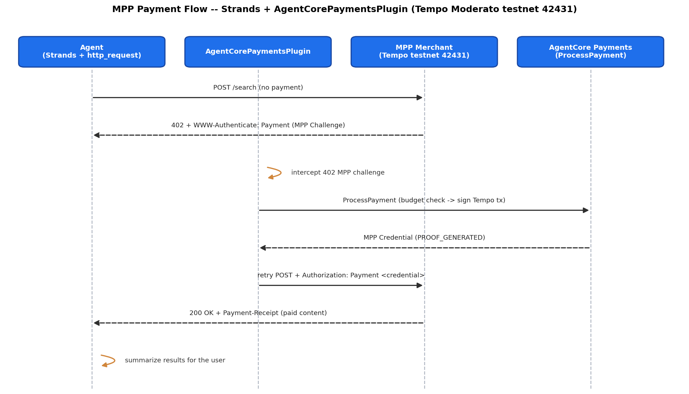

# Tutorial 08 -- MPP (Machine Payments Protocol)

| Information         | Details                                                              |
|:--------------------|:---------------------------------------------------------------------|
| Tutorial type       | Conversational                                                       |
| Agent type          | Single, payment-enabled                                              |
| Frameworks          | Strands Agents                                                       |
| LLM model           | Anthropic Claude Sonnet 4 (`anthropic.claude-sonnet-4-6`)            |
| Components          | `PaymentManager`, `AgentCorePaymentsPlugin`, MPP endpoints, sessions |
| Complexity          | Intermediate                                                         |

> **Reads** the shared `.env` from Tutorial 00 (`PAYMENT_MANAGER_ARN`, `USER_ID`, `INSTRUMENT_ID`).
> **Does** run a local agent that creates a per-run spending session in-code with the SDK and pays
> an MPP endpoint automatically under a budget -- nothing new is deployed.
> -> [How the pieces fit together](../README.md#cli-vs-sdk)

## Overview

[MPP (Machine Payments Protocol)](https://mpp.dev/overview) is co-authored by Stripe and Tempo and
is on the IETF standards track. It generalizes HTTP-402 into a payment-method-agnostic, intent-based
**Challenge -> Credential -> Receipt** flow:

- **Challenge** (server -> client): `WWW-Authenticate: Payment` -- declares cost, method, intent, expiry.
- **Credential** (client -> server): `Authorization: Payment` -- proof of payment, bound to the challenge.
- **Receipt** (server -> client): `Payment-Receipt` -- confirms acceptance (proof of delivery).

The shared payment stack -- payment manager, connector, IAM roles, and a funded wallet (instrument) --
is already provisioned from [Tutorial 00](../00-setup-agentcore-payments/). Here your agent code uses
the AgentCore SDK to open a **spending session** (a per-request budget you set per user) and pay each
MPP 402 automatically. The `AgentCorePaymentsPlugin` intercepts the MPP challenge from the
`http_request` tool and settles it -- zero payment logic in the agent code. MPP charge
merchants advertise `feePayer=false`, so the buyer must authorize gas fees.
The testnet endpoint (`mpp.dev`) sponsors gas (no config needed); mainnet merchants
(Browserbase, etc.) require `buyer_pays_gas_fees=True` in the plugin config.

> **MPP uses the Stripe/Privy instrument.** MPP `charge` merchants settle on the **Tempo** network
> (Moderato testnet, chainId 42431). Coinbase-managed instruments cannot sign Tempo -- the service returns
> "Tempo payments are not supported for Coinbase-managed payment instruments." Set
> `CREDENTIAL_PROVIDER_TYPE=StripePrivy` in your `.env` and use the Privy instrument from Tutorial 00.

> **Billable resources.** Each successful MPP call spends stablecoin from your funded Tempo wallet
> (testnet pathUSD on Moderato, or real funds on mainnet endpoints) and is metered by AgentCore payments.
> See [AgentCore pricing](https://aws.amazon.com/bedrock/agentcore/pricing/).

> **Testnet recommended.** Use a Tempo Moderato testnet wallet funded with pathUSD (testnet tokens have
> no monetary value) against a testnet MPP endpoint. Note the sample endpoints listed later are **live on
> Tempo mainnet and settle real funds** -- only call those if you intend to pay real money.

> **Supported regions:** `us-east-1`, `us-west-2`, `eu-west-2`, `eu-central-1`, `ap-southeast-2`.

## Architecture

### Strands



```
Agent (Strands + http_request tool)
  |
  |--> http_request POST https://mpp.browserbase.com/search
  |                         |
  |                   Server returns HTTP 402 + WWW-Authenticate: Payment (MPP Challenge)
  |                         |
  |         AgentCorePaymentsPlugin intercepts the 402 MPP challenge
  |                         |
  |         ProcessPayment -> budget check -> sign Tempo tx -> return MPP Credential
  |                         |
  |         Plugin retries http_request with Authorization: Payment <credential>
  |                         |
  |--> 200 OK + Payment-Receipt -- agent receives paid content
  |
  +--> Agent summarizes results for the user
```

### MPP vs x402

| Aspect            | x402 (Tutorials 01-07)                | MPP (this tutorial)                       |
|:------------------|:--------------------------------------|:------------------------------------------|
| 402 challenge     | `X-PAYMENT` header                    | `WWW-Authenticate: Payment` header        |
| Credential header | `X-PAYMENT`                           | `Authorization: Payment`                  |
| Receipt           | `X-PAYMENT-RESPONSE`                  | `Payment-Receipt`                         |
| Settlement rail   | Base via Coinbase CDP                 | Tempo via Stripe/Privy                    |
| Test network      | Base Sepolia                          | Tempo Moderato testnet (chain 42431)      |
| Intents           | schemes: `exact`, `upto`              | intents: `charge`, `session`              |

## Prerequisites

- **Tutorial 00 completed** -- the shared `.env` (one directory up, at
  [`00-getting-started/.env`](../)) must contain `PAYMENT_MANAGER_ARN`, `USER_ID`, and
  `INSTRUMENT_ID`. The script reads these via `utils.load_tutorial_env()`.
- **Stripe/Privy instrument** -- set `CREDENTIAL_PROVIDER_TYPE=StripePrivy` in `.env`. MPP charge on
  Tempo cannot be signed by a Coinbase-managed instrument.
- **Funded Tempo wallet with delegated signing granted** -- the instrument's wallet must hold testnet
  pathUSD on Tempo and have delegated signing enabled (done in Tutorial 00). Without it, the 402
  payment step fails.
- **Python 3.10+** and AWS credentials configured (`aws sts get-caller-identity`).
- **MPP-enabled SDK** -- MPP support requires `bedrock-agentcore >= 1.20.0`. The
  `AgentCorePaymentsPlugin` auto-detects MPP `WWW-Authenticate: Payment` 402 challenges
  natively (no extra code beyond `buyer_pays_gas_fees` on the plugin config):
  ```bash
  pip install -r requirements.txt
  ```

## Walkthrough

### Step 1 -- Confirm Tutorial 00 populated the shared `.env`

The agent loads its configuration from the shared `.env` one directory up. Confirm the keys it reads
are present, and that the provider is set to Stripe/Privy:

```bash
grep -E 'PAYMENT_MANAGER_ARN|INSTRUMENT_ID|USER_ID|CREDENTIAL_PROVIDER_TYPE' ../.env
```

If `PAYMENT_MANAGER_ARN`, `INSTRUMENT_ID`, or `USER_ID` is missing, re-run Tutorial 00
([`../00-setup-agentcore-payments/`](../00-setup-agentcore-payments/)). For MPP, make sure
`CREDENTIAL_PROVIDER_TYPE=StripePrivy` so the Privy (Tempo-capable) instrument is used.

### Step 2 -- Run the Strands agent

```bash
python strands_mpp_agent_testnet.py
```

The script loads the manager ARN and Privy instrument from `.env`, creates a per-run spending session
in-code with the SDK (`manager.create_payment_session(...)`, budget set by the `SESSION_BUDGET`
constant near the top), wires up `AgentCorePaymentsPlugin`, and asks the agent to call the MPP
endpoint -- the plugin settles the HTTP 402 MPP challenge automatically within the session budget.
(This is the flow in the **Strands MPP Payment Flow** diagram under [Architecture](#architecture).)

## Modules

This tutorial includes two modules. Start with testnet (Module A) to learn the flow risk-free,
then optionally graduate to mainnet (Module B) for a real-world use case.

### Module A -- Testnet (default, zero cost)

```bash
python strands_mpp_agent_testnet.py
```

Runs the full MPP happy path against `mpp.dev/api/ping/paid` on **Tempo Moderato testnet
(chain 42431)**. Uses free test pathUSD tokens, the merchant covers gas fees. Anyone can run
it safely to see the complete Challenge -> Credential -> Receipt flow with budget enforcement.

- No real funds spent
- Wallet funded via testnet faucet (`tempo_fundAddress`)
- `buyer_pays_gas_fees=False` (merchant sponsors gas)

### Module B -- Mainnet, competitive intelligence research (opt-in)

```bash
python strands_mpp_agent_mainnet.py
```

A research assistant that pays **Browserbase** ($0.01/search) on **Tempo mainnet (chain 4217)**
to gather competitive and market intelligence on a company or product, then summarizes findings.
Returns real data from live paid APIs.

- **Spends real funds** -- gated behind explicit opt-in confirmation
- Wallet funded with real pathUSD on Tempo mainnet
- `buyer_pays_gas_fees=True` (buyer covers gas)
- Prompts for a research target, makes 2-3 paid searches, delivers a structured briefing

### Which module to run

| Goal | Module | Script | Cost |
|:-----|:-------|:-------|:-----|
| Learn the MPP flow (testnet, safe) | A | `strands_mpp_agent_testnet.py` | Free |
| Real competitive research (mainnet) | B | `strands_mpp_agent_mainnet.py` | ~$0.01-0.03 |

## Try different budgets (payment limits)

Budget enforcement lives on the session. Change the budget by editing the constant near the top of
the script, then re-run. For example, set a tiny budget smaller than the API cost:

```python
# strands_mpp_agent_testnet.py -- creates the session in-code
SESSION_BUDGET = {"maxSpendAmount": {"value": "0.0001", "currency": "USD"}}
```

Re-run the agent -- the payment is rejected because the $0.0001 budget is smaller than the API cost.
Enforcement is structural (service-level), not agent logic.

```python
# Read a session's remaining budget in-code with the SDK:
sess = manager.get_payment_session(user_id=USER_ID, payment_session_id=SESSION_ID)
print(sess["availableLimits"]["availableSpendAmount"])
```

## What the agent does

| Scenario     | How to run it                          | What it shows                                        |
|:-------------|:---------------------------------------|:-----------------------------------------------------|
| Happy path   | Default run ($1.00 session)            | The MPP 402 -> sign -> retry -> 200 flow, automatic  |
| Budget limit | Set the budget to `$0.0001`, re-run    | Server-side budget enforcement rejects the payment   |
| Wrong rail   | Use a Coinbase instrument              | Service rejects Tempo for Coinbase-managed instrument |

## Sample MPP endpoints (Tempo)

> **These are live mainnet endpoints and settle real funds.** The costs below are charged in
> real stablecoin on Tempo mainnet, not testnet. To run the happy path without spending real money,
> point the agent at a testnet MPP endpoint (or your own MPP server on Tempo Moderato testnet, chain
> 42431) and fund the wallet with testnet pathUSD. Only call the endpoints below if you intend to pay
> real funds.

| Service     | URL                                              | Cost   |
|:------------|:-------------------------------------------------|:-------|
| AgentMail   | `GET https://mpp.api.agentmail.to/v0/inboxes`    | free   |
| Browserbase | `POST https://mpp.browserbase.com/search`        | $0.01  |
| Allium      | `POST https://agents.allium.so/api/v1/developer/prices` | $0.02 |

## Security and compliance

- [AWS Shared Responsibility Model](https://aws.amazon.com/compliance/shared-responsibility-model/)
- [AgentCore payments security best practices](https://docs.aws.amazon.com/bedrock-agentcore/latest/devguide/payments-security-best-practices.html)

## Observability

Enable observability on your Payment Manager to trace payment operations, monitor
transaction success rates, and troubleshoot errors. AgentCore payments automatically
generates spans and metrics for every data plane API call, viewable in Amazon CloudWatch
and AWS X-Ray via AgentCore Observability.

See: [AgentCore payments observability data](https://docs.aws.amazon.com/bedrock-agentcore/latest/devguide/observability-payments-metrics.html)

## Troubleshooting

| Symptom | Cause | Resolution |
|:--------|:------|:-----------|
| ProcessPayment rejects the challenge over gas fees | The challenge advertises `feePayer=false` (buyer pays gas) and the request did not authorize it. | Set `buyer_pays_gas_fees=True` on the plugin config (already set in this tutorial). |
| The payment does not settle (agent run stops) | Delegated signing not granted for the wallet, the wallet is not funded with testnet pathUSD, or a Coinbase instrument is configured. | Grant delegated signing (Tutorial 00), fund the Tempo wallet from the testnet faucet, and confirm a Stripe/Privy instrument. |

## References

- [AgentCore payments GA blog](https://aws.amazon.com/blogs/machine-learning/amazon-bedrock-agentcore-payments-is-now-generally-available-enabling-agents-to-transact-safely-and-autonomously-at-scale/)
- [MPP Protocol Overview](https://mpp.dev/overview)
- [MPP credential spec](https://mpp.dev/protocol/credentials)
- [Payment HTTP Authentication spec](https://paymentauth.org/draft-httpauth-payment-00.html)
- [AgentCore Payments pricing](https://aws.amazon.com/bedrock/agentcore/pricing/)
