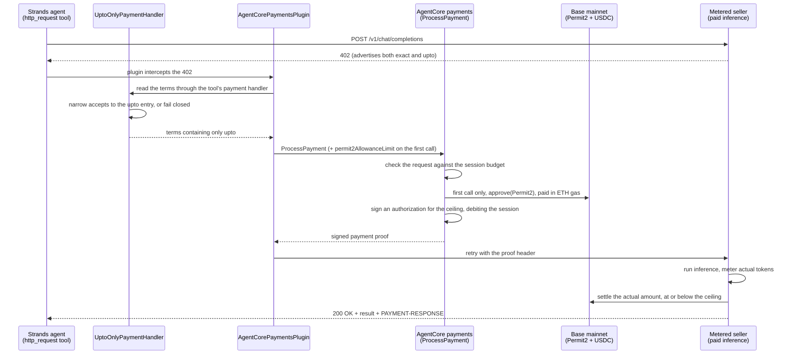
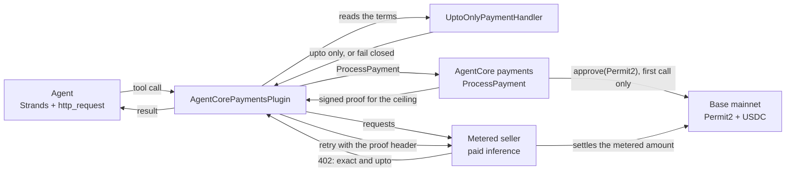

# Tutorial 09 — Pay Per Use with the x402 `upto` Scheme

> **Real funds on mainnet.** This tutorial runs on Base mainnet and transfers **real USDC** from the
> wallet connected to your payment instrument, at approximately **$0.003 per call**. On-chain
> settlement is final and cannot be reversed.
>
> The script refuses to run until you opt in explicitly:
>
> ```bash
> UPTO_ALLOW_MAINNET=1 python upto_payment_agent.py
> ```
>
> Fund the wallet with only what you intend to spend, keep the session limit (`maxSpendAmount`) at the
> default `$0.05` or lower, and complete [Tutorial 01](../01-agents-payments-and-limits/) on testnet
> first to validate your setup.

| Information         | Details                                                                    |
|:--------------------|:---------------------------------------------------------------------------|
| Tutorial type       | Conversational                                                             |
| Agent type          | Single, payment-enabled                                                    |
| Agentic Framework   | Strands Agents                                                             |
| LLM model           | Anthropic Claude Sonnet 4.6 (`us.anthropic.claude-sonnet-4-6`)             |
| Components          | `PaymentManager`, `AgentCorePaymentsPlugin`, x402 `upto` scheme, Permit2, sessions |
| SDK requirement     | `bedrock-agentcore>=1.22.0` (the release that adds `upto`)                  |
| Example complexity  | Intermediate                                                               |

> **Reads** the shared `.env` from Tutorial 00 (`PAYMENT_MANAGER_ARN`, `USER_ID`, `INSTRUMENT_ID`).
> **Does** run a local Strands agent that buys metered inference from an x402 `upto` seller, granting
> the one-time Permit2 approval on its first payment and omitting it afterwards.
> → [How the pieces fit together](../README.md#cli-vs-sdk)

## Overview

Every other tutorial here pays a fixed price: the seller declares $0.01 and the agent pays $0.01. That
is the x402 `exact` scheme, and it applies when the price is known before the work is done.

A metered seller cannot quote a price in advance, because the cost depends on the tokens generated. The
`upto` scheme replaces the price with a **ceiling**: the buyer authorizes a maximum, and the seller
settles the amount actually consumed.

| | `exact` | `upto` |
|---|---|---|
| Amount in the 402 | the price | a **ceiling**, the maximum for this request |
| Buyer authorizes | the price | that ceiling |
| Seller settles | the same amount | the **actual amount consumed** |
| Settlement | a direct transfer | through the Permit2 contract |
| Wallet setup | no allowance handling | a one-time Permit2 allowance |

**Amazon Bedrock AgentCore payments supports both schemes, and `AgentCorePaymentsPlugin` pays either
one for you** — it intercepts the 402, calls `ProcessPayment`, and retries with the proof, exactly as in
[Tutorial 01](../01-agents-payments-and-limits/). All the `upto`-specific signing happens server-side
inside `ProcessPayment`; see
[Process a payment](https://docs.aws.amazon.com/bedrock-agentcore/latest/devguide/payments-process-payment.html)
for the scheme reference.

What this tutorial adds is that the buyer **states which scheme it is willing to pay with**. The seller
used here advertises `exact` *and* `upto` at the same price on the same network, and without an explicit
choice the run would pay with `exact`. See [Pinning the scheme](#pinning-the-scheme).

The payment manager, connector, IAM roles, and funded wallet are already provisioned by
[Tutorial 00](../00-setup-agentcore-payments/). The `upto` scheme needs no additional infrastructure and
no AgentCore CLI configuration, because the scheme and the Permit2 approval are per-request data-plane
concerns.

> **Billable resources.** Each call is metered by AgentCore payments and spends USDC from your wallet.
> See [AgentCore pricing](https://aws.amazon.com/bedrock/agentcore/pricing/) and [Cost](#cost).

> **Third-party services.** This tutorial integrates with Coinbase Developer Platform (CDP) or
> Stripe (Privy) for wallets, the Uniswap Permit2 contract, and a third-party inference endpoint. AWS
> does not control these services and makes no representation about their availability, pricing, or
> terms of use.

> **Supported regions.** Run this in a region where AgentCore payments is available — see
> [AgentCore supported regions](https://docs.aws.amazon.com/bedrock-agentcore/latest/devguide/agentcore-regions.html).

> **Compliance.** For the current compliance scope of Amazon Bedrock AgentCore, see
> [Compliance validation for Amazon Bedrock AgentCore](https://docs.aws.amazon.com/bedrock-agentcore/latest/devguide/compliance-validation.html)
> and download the attestation from [AWS Artifact](https://aws.amazon.com/artifact/).

## Cost

| Cost | Charged by | Amount |
|---|---|---|
| AgentCore payments metering | AWS | See [AgentCore pricing](https://aws.amazon.com/bedrock/agentcore/pricing/) |
| Bedrock inference for the agent | AWS | Per-token, see [Bedrock pricing](https://aws.amazon.com/bedrock/pricing/) |
| Metered inference from the seller | Third-party seller | ~$0.003 USDC per call, from your wallet |
| One-time Permit2 approval | Base network gas fee | A fraction of a cent in ETH, from your wallet |

The USDC and ETH amounts are paid from your wallet. They are **not** AWS charges and do not appear on
your AWS bill. The default run makes two paid calls.

## Architecture



The same path, as components:



## Pinning the scheme

A seller may advertise several ways to pay, and the order is not meaningful. This one returns:

```
accepts[0]  scheme=exact  amount=3302  network=eip155:8453   (fixed price)
accepts[1]  scheme=upto   amount=3302  network=eip155:8453   (ceiling for this request)
```

The plugin selects an entry by **network** (`network_preferences_config`) and has no scheme preference.
Both entries share `eip155:8453`, so no network preference can separate them and the plugin resolves to
`accepts[0]` — `exact`. `permit2AllowanceLimit` applies only to the `upto` scheme, so the plugin sends it
only when the resolved scheme is `upto`. If `exact` wins, the allowance is never applied and no error is
raised: the run looks successful while paying under the wrong scheme.

A **payment handler** is the plugin's extension point between a tool's raw 402 and the payment call:
whatever it returns is what the plugin selects from. Narrowing `accepts` there expresses the scheme
preference the config has no field for, and leaves budget check, signing, and retry inside the plugin:

```python
from bedrock_agentcore.payments.integrations import handlers

class UptoOnlyPaymentHandler(handlers.HttpRequestPaymentHandler):
    """Only ever let the plugin see `upto` terms."""

    def extract_headers(self, result):   # terms in the base64 PAYMENT-REQUIRED header
        ...

    def extract_body(self, result):      # terms in the response body
        ...

handlers.PAYMENT_HANDLERS["http_request"] = UptoOnlyPaymentHandler()
```

Both extraction points are narrowed because either can carry the terms, and the SDK prefers the header
whenever it is present.

The handler fails closed: if a seller stops offering `upto`, the script exits instead of falling back to
`exact`.

When a seller offers a single scheme, none of this is needed — Tutorial 01's plain plugin setup is
enough.

## What `upto` changes

### 1. A session limits authorization, not settlement

A payment session limits what AgentCore payments will **sign for**, not what settles on-chain. It is
debited the ceiling it signed for, and the unspent difference is not credited back:

| | Amount |
|---|---|
| Authorized, and debited from the session | `$0.003303` |
| Settled on-chain, and charged to your wallet | `$0.003003` |

Before signing, AgentCore payments checks the request against the session budget and rejects requests
that would push the session past its cap. The script prints the remaining budget at each step.

### 2. A new wallet needs one on-chain approval, and it costs gas

The `upto` scheme settles through Permit2, Uniswap's token approval contract, because the settled amount
is unknown when the buyer signs. Permit2 moves funds with `transferFrom`, so the payer wallet must first
grant it an ERC-20 allowance — once per wallet, asset, and chain. Your agent does not call Permit2
directly. See *Permit2 allowance for upto payments* in
[Process a payment](https://docs.aws.amazon.com/bedrock-agentcore/latest/devguide/payments-process-payment.html).

Set `permit2_allowance_limit` on the **first** payment from a new instrument, and `ProcessPayment`
submits the approval before it signs:

```python
AgentCorePaymentsPluginConfig(
    ...,
    permit2_allowance_limit="1000000",  # 1 USDC at 6 decimals — the cap Permit2 may ever transfer
)
```

That approval is an on-chain transaction, so it costs a gas fee in **native token** (ETH on Base) from
the wallet's own balance. Every other tutorial in this series works with a USDC-only wallet.

**Omit the field on every later payment.** `approve` *sets* the allowance rather than adding to it, so
re-sending it grants nothing new and costs a redundant on-chain transaction. Only the first payment needs
ETH; every payment needs USDC.

The approval is granted **per wallet**, so a `.env` holding two wallet providers grants it once per
wallet — see [Choosing which wallet pays](#choosing-which-wallet-pays).

Step 5 grants the approval by default, assuming a wallet that has never paid with `upto`. Re-run against
the same wallet with the approval skipped:

```bash
UPTO_ALLOW_MAINNET=1 UPTO_GRANT_PERMIT2_ALLOWANCE=0 python upto_payment_agent.py
```

Whatever value you set is the outer bound on what Permit2 can ever move from that wallet. Passing the
maximum `uint256` value as a string grants an unlimited allowance instead.

## Prerequisites

- **Tutorial 00 completed** — the shared `.env` one directory up must contain `PAYMENT_MANAGER_ARN`,
  `USER_ID`, and `INSTRUMENT_ID`. The `upto` scheme works with either wallet provider, Coinbase CDP or
  Stripe (Privy), and needs no new payment manager or connector.
- **Delegated signing granted** for the wallet (Tutorial 00). The end user must authorize the agent to
  transact on their behalf before any payment can be signed.
- **USDC on Base mainnet** above the seller's declared ceiling. There is no mainnet faucet, so transfer
  USDC to the wallet address (`manager.get_payment_instrument(...)` returns it).
- **A few cents of ETH on Base mainnet** for the one-time Permit2 approval.
- **Python 3.10+** and AWS credentials configured (`aws sts get-caller-identity`).
- **Python dependencies** — `upto` needs `bedrock-agentcore>=1.22.0`, the release that adds the plugin's
  `permit2_allowance_limit` field:
  ```bash
  pip install -r requirements.txt
  ```
- **AgentCore CLI (optional)** — only for the inspect step. Requires Node.js 20+:
  ```bash
  npm install -g @aws/agentcore
  ```

## Walkthrough

### Step 1 — Confirm Tutorial 00 populated the shared `.env`

```bash
grep -E 'PAYMENT_MANAGER_ARN|INSTRUMENT_ID|USER_ID' ../.env
```

If any is missing, run [Tutorial 00](../00-setup-agentcore-payments/) again.

### Step 2 — Run the agent

```bash
UPTO_ALLOW_MAINNET=1 python upto_payment_agent.py
```

The agent reads the seller's 402 (costs nothing and signs nothing), pins the scheme, and makes two
payments from the same wallet and session: one that grants the Permit2 approval and one that does not.

```
── Step 2: What the seller is asking for ──
   HTTP 402 — the seller declares 2 way(s) to pay:
     accepts[0]  scheme=exact  amount=3302     network=eip155:8453  (fixed price)
     accepts[1]  scheme=upto   amount=3302     network=eip155:8453  (ceiling for this request)

   This seller lists 'exact' first and 'upto' second, both on the same network. The plugin
   selects by network only, so the handler below narrows the terms to the 'upto' entry
   before the plugin chooses.

── Step 3: Scheme pinned to 'upto' via UptoOnlyPaymentHandler ──

── Step 5: First `upto` payment ── budget {'value': '0.05', 'currency': 'USD'}
   ... authorized 3303 atomic ($0.003303) · settled 3003 atomic ($0.003003) · 99 tokens

Budget after payment 1: {'value': '0.046697', 'currency': 'USD'}
Debited at the ceiling that was signed for, not at the amount the seller settled.
```

The budget dropped by the ceiling, even though a smaller amount settled. The ceiling is quoted per
request, so it varies slightly between calls.

### Step 3 — Confirm the session limit denies an over-budget payment (optional)

The check is deterministic and runs at the infrastructure layer, and the agent cannot extend its session
or spend beyond the session's payment limits. Set a budget below the seller's ceiling:

```bash
UPTO_ALLOW_MAINNET=1 UPTO_SESSION_BUDGET=0.0001 python upto_payment_agent.py
```

### Step 4 — Verify the settlement on-chain (optional)

With `upto`, the authorized and settled amounts differ. Follow
[Inspect / verify](#inspect--verify) to compare the ceiling the session was charged against the transfer
that actually landed.

## Choosing which wallet pays

`load_tutorial_env()` resolves a single `instrument_id` from `CREDENTIAL_PROVIDER_TYPE`, so a
single-provider `.env` needs no configuration. A `.env` provisioned for both wallet providers (see
[Tutorial 07](../07-multi-agent-payment-orchestrator/)) also carries one instrument per provider, and
`UPTO_PROVIDER` picks the payer:

```bash
UPTO_ALLOW_MAINNET=1 UPTO_PROVIDER=coinbase     python upto_payment_agent.py
UPTO_ALLOW_MAINNET=1 UPTO_PROVIDER=stripe_privy python upto_payment_agent.py
```

The script prints which wallet it is paying from, and exits listing the configured providers if
`UPTO_PROVIDER` names one that is not in the `.env`.

The Permit2 approval is granted per wallet, so each provider's wallet needs its own one-time `approve`
before it can settle `upto`.

## Switching sellers

The `SELLERS` dictionary holds one entry per endpoint, and `.env` selects which runs:

```bash
UPTO_ALLOW_MAINNET=1                 # required: opt in to spending real USDC on mainnet
UPTO_SELLER=surplus                  # key from the SELLERS dictionary (default)
UPTO_SELLER_MODEL=                   # optional: override the model id
UPTO_PROVIDER=                       # optional: coinbase | stripe_privy, for a multi-provider .env
UPTO_SESSION_BUDGET=0.05             # optional: authorization limit in USD
UPTO_PERMIT2_ALLOWANCE_LIMIT=1000000 # optional: one-time Permit2 cap, smallest denomination
UPTO_GRANT_PERMIT2_ALLOWANCE=1       # optional: set to 0 on an already-approved wallet
```

To use an endpoint that is not in the dictionary:

```bash
UPTO_SELLER_URL=https://your-seller.example.com/v1/chat/completions
UPTO_SELLER_MODEL=your-model-id
```

The URL must be `https`; the script validates the scheme before making any request. The system prompt
also forbids the agent from following free-trial or alternative URLs a seller returns in the 402 body,
since the plugin, not the model, decides what gets signed. Metered endpoints are also discoverable
through the Coinbase x402 Bazaar MCP server, which
[Tutorial 04](../04-agent-with-coinbase-bazaar-via-gateway/) fronts with an AgentCore Gateway.

Any replacement seller must advertise `upto`. If it does not, the script exits at Step 2 with the list of
schemes it did offer rather than paying under a scheme you did not choose.

Model ids change. A stale id returns `404 no_sellers_for_model` **after** payment verification, which
resembles a payment failure but is not one:

```bash
curl -s https://api.surplusintelligence.ai/v1/models | jq -r '.data[].id'
```

## Inspect / verify

```bash
# Live view of managers, connectors, and payment status (requires the AgentCore CLI), run from the
# Tutorial 00 project dir because `status --type payment` reads a scaffolded project's config:
cd ../00-setup-agentcore-payments/PaymentSetup && agentcore status --type payment
```

Read the session's remaining authorization limit, which is what the script prints between steps:

```python
sess = manager.get_payment_session(user_id=USER_ID, payment_session_id=SESSION_ID)
print(sess["availableLimits"]["availableSpendAmount"])  # drops by the ceiling, not the settlement
```

Check the wallet's USDC balance on Base **mainnet** (`chain="BASE"`, not `BASE_SEPOLIA`):

```python
bal = manager.get_payment_instrument_balance(
    payment_connector_id=PAYMENT_CONNECTOR_ID,
    payment_instrument_id=INSTRUMENT_ID,
    chain="BASE",
    token="USDC",
    user_id=USER_ID,
)
print(bal["tokenBalance"]["amount"] / 1_000_000, "USDC")  # micro-USDC → USDC
```

To confirm what moved, take the transaction hash from the seller's `PAYMENT-RESPONSE` header and look it
up on [BaseScan](https://basescan.org/). The transfer amount there is the settled amount; compare it
against the ceiling the session was charged. On a wallet's first payment you also see the separate
`approve` transaction and the ETH that paid its gas fee.

## Troubleshooting

| Symptom | Cause | Fix |
|---|---|---|
| The script exits saying it settles real USDC | The mainnet opt-in is missing — by design | Re-run with `UPTO_ALLOW_MAINNET=1` once you accept the cost |
| `load_tutorial_env()` raises `FileNotFoundError`, or `PaymentManager` fails because the manager ARN is missing | Tutorial 00 did not finish — `../.env` has no resource IDs | Run Tutorial 00 again |
| `Fail closed: seller offers ['exact'], not 'upto'` | The seller no longer advertises `upto` | Use a seller that does, or run Tutorial 01 for the `exact` flow |
| The agent receives a 402 but the payment fails | Delegated signing was never granted for this wallet | Grant it with your wallet provider as described in [Tutorial 00](../00-setup-agentcore-payments/), then re-run |
| The payment fails on a wallet's first `upto` call, or the approval never lands | `approve(Permit2)` could not be submitted — the wallet holds USDC but no ETH for the gas fee | Send a few cents of ETH on Base and re-run. Required once per wallet, asset, and chain |
| The payment is signed, then the seller rejects the request | The wallet's Permit2 allowance is missing or too low, so settlement fails after signing with a Permit2-allowance precondition error — and **the session was already debited the ceiling** | Confirm on [BaseScan](https://basescan.org/) that the `approve` landed, then re-run with `UPTO_GRANT_PERMIT2_ALLOWANCE=0` |
| The budget is exceeded immediately | The session limit is below the seller's declared ceiling, so the budget check denies the request before signing | Raise `UPTO_SESSION_BUDGET` |
| `404 no_sellers_for_model` **after** a successful payment | The model id is not in the seller's catalog — a seller error, not a payment error | Set `UPTO_SELLER_MODEL` to a current id |

## Clean Up

Running the agent locally provisions nothing durable, and the payment session expires on its own after
15 minutes. To stop authorizations sooner, delete it:

```python
manager.delete_payment_session(user_id=USER_ID, payment_session_id=SESSION_ID)
```

Deleting the payment instrument stops any further payment from that wallet. Neither reverses
transactions that already settled.

The Permit2 approval stays on-chain by design; that is what lets later payments skip the approval.
Revoking it means sending your own `approve(Permit2, 0)` transaction.

The shared manager, connector, and instrument are removed in
[Tutorial 00](../00-setup-agentcore-payments/)'s Clean Up.

## Next steps

- **[Tutorial 03](../03-user-onboarding-wallet-funding/)** — per-user wallet onboarding, funding,
  delegation, and balance checks. `upto` needs both USDC and the ETH that the `approve(Permit2)` gas
  fee is paid in.
- **[Tutorial 07](../07-multi-agent-payment-orchestrator/)** — multiple agents, separate wallets,
  per-agent budgets. The Permit2 approval is per wallet, so each one grants it on its first payment.
- **[Tutorial 02](../02-deploy-to-agentcore-runtime/)** — deploy this agent to AgentCore Runtime with
  role separation using the AgentCore CLI.
- **[Tutorial 04](../04-agent-with-coinbase-bazaar-via-gateway/)** — discover and call paid MCP tools
  on Coinbase Bazaar through an AgentCore Gateway.
