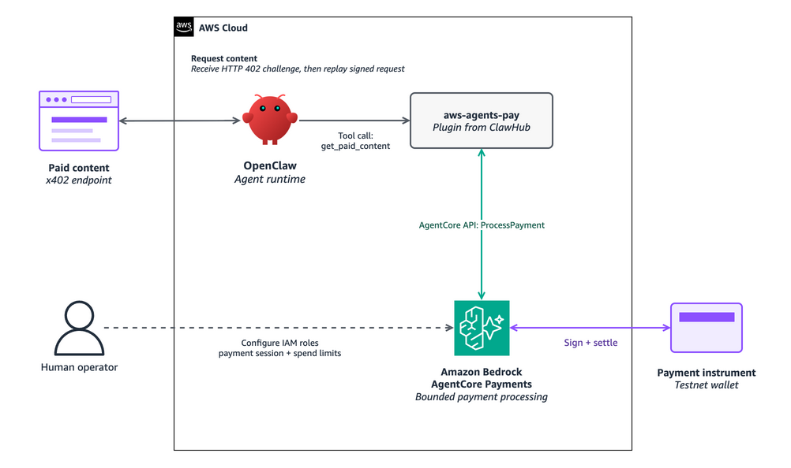

# Converse with an OpenClaw agent -- no coding assistant

> **Disclaimer:** This sample is for learning and validation. Review the
> security, compliance, IAM, wallet, and spending controls before adapting it
> for production.

| Information | Details |
|:--|:--|
| Tutorial type | Conversational |
| Agent type | Single agent with a bounded payment runtime |
| Agent framework | [OpenClaw](https://openclaw.ai) |
| Components | OpenClaw, `@aws/aws-agents-pay`, AgentCore Payments, x402 v2 |



**Figure 1:** OpenClaw calls a paid x402 endpoint, which returns an HTTP 402
challenge. The `aws-agents-pay` plugin hands that challenge to Amazon Bedrock
AgentCore Payments, which signs and settles against the payment instrument
(testnet wallet) within the bounds a human operator configured up front
(dashed line). OpenClaw never touches the wallet or IAM directly.

OpenClaw can be hosted on AWS alongside AgentCore Payments -- see
[aws-samples/sample-openclaw-on-aws](https://github.com/aws-samples/sample-openclaw-on-aws)
for deployment options, including AgentCore Runtime Instances, Amazon EC2,
and Amazon EKS. This tutorial's steps apply regardless of where you choose
to run OpenClaw.

Unlike the other two paths in this folder, this one skips the coding-assistant
handoff entirely -- there is no `AGENTS.md` to load and no prompt to hand to a
coding assistant. OpenClaw installs the plugin and reads its config directly.

For the security boundary between human-run administration and the
model-facing runtime, see the bundled skill's
[security model](https://github.com/aws/agent-toolkit-for-aws/tree/main/plugins/aws-agents/skills/agents-pay/references/security-model.md)
and
[AgentCore Payments IAM roles](https://docs.aws.amazon.com/bedrock-agentcore/latest/devguide/payments-iam-roles.html).

## 1. Install the package

```bash
openclaw plugins install clawhub:@aws/aws-agents-pay
```

The package name is `@aws/aws-agents-pay`, the installed plugin ID is
`aws-agents-pay`, and the bundled skill name is `agents-pay`.

Verify that the runtime exposes exactly:

- `get_payment_session_status`, which checks the configured payment session
- `get_paid_content`, which requests an approved paid URL and completes the
  payment within the configured policy

The runtime must not expose setup, session-creation, or raw-proof tools.

## 2. Provision payment infrastructure

Payment infrastructure (manager, connector, instrument, session) does not
exist yet after Step 1 -- installing the plugin only wires up the model-facing
runtime tools. Provisioning still goes through the human-only admin CLI
either way; OpenClaw cannot create this infrastructure for you. Pick how you
want to run those steps:

- **Option A -- OpenClaw-assisted.** Ask OpenClaw to walk you through it:

  ```
  Help me set up the agents-pay skill.
  ```

  OpenClaw explains each `agentcore` CLI prompt and admin-script step as you
  go, but you still run the commands and type `approve` yourself. Session
  creation has no `--yes` flag and refuses outright without an interactive
  terminal -- that gate exists specifically so an agent cannot self-approve
  its own spending session, and OpenClaw walking you through it does not
  change that.

- **Option B -- Fully manual.** Follow the
  [AgentCore Payments getting started guide](https://docs.aws.amazon.com/bedrock-agentcore/latest/devguide/payments-getting-started.html)
  or the skill's
  [operator guide](https://github.com/aws/agent-toolkit-for-aws/tree/main/plugins/aws-agents/skills/agents-pay/references/operator-guide.md)
  directly, with no OpenClaw involvement until you wire the resulting
  resource IDs into the config in Step 3.

Both options run the identical `agentcore` CLI wizards and admin script for
manager, connector, instrument, and session creation. The only difference is
whether OpenClaw explains each prompt as you go or you read the docs
yourself -- either way, provisioning happens in your own terminal, under your
own credentials, with typed human approval for session creation.

## 3. Configure trusted policy

Configure the package with the operator-created resources from Step 2 and an
explicit payment policy:

```json
{
  "plugins": {
    "allow": ["aws-agents-pay"],
    "entries": {
      "aws-agents-pay": {
        "enabled": true,
        "config": {
          "region": "us-east-1",
          "paymentManagerArn": "arn:aws:bedrock-agentcore:us-east-1:ACCOUNT:payment-manager/NAME",
          "paymentInstrumentId": "payment-instrument-EXAMPLE",
          "payment_session_id": "payment-session-EXAMPLE",
          "userId": "openclaw-test-user",
          "networkPreferences": ["eip155:84532"],
          "allowedOrigins": ["https://sandbox.node4all.com"],
          "allowedRecipients": [
            "0xd275612Bf0BB35638432c4D95eAA8D5d22346Ca6"
          ],
          "allowedAssetsByNetwork": {
            "eip155:84532": [
              "0x036CbD53842c5426634e7929541eC2318f3dCF7e"
            ]
          },
          "maxPaymentAmountAtomic": "100000",
          "returnBody": true
        }
      }
    }
  }
}
```

If omitted, `region` defaults to `us-east-1`. Set it explicitly to your
payment manager's actual deployment region if it lives elsewhere -- the
plugin will not warn you on a mismatch, it will just fail to find the
manager.

`100000` is 0.10 USDC at six decimals. This is the per-payment ceiling, not
the same as the session budget -- the session (created out of band) separately
limits cumulative spend until it expires or is exhausted.

`allowedOrigins` and `allowedRecipients` above are the actual origin and
`payTo` address for the Step 4 test endpoint
(`sandbox.node4all.com/v1/x402-test`), taken directly from its x402 challenge
response -- not generic placeholders. Copy this config as written and Step 4
will complete an end-to-end payment. Swap in your own merchant origin and
recipient, verified out of band, once you move past this walkthrough. No
other path in this folder uses this config format -- it is specific to the
`aws-agents-pay` OpenClaw plugin.

For a fixed merchant set, verify every address in `allowedRecipients` out of
band using merchant documentation or another known-good source. For broader
discovery scenarios, set `allowAnyRecipient: true` instead of
`allowedRecipients` to let the publisher select the beneficiary -- the two
options are mutually exclusive. This trades recipient allowlisting for
flexibility; origin, network, asset, per-payment, and session-budget controls
still apply.

The sandbox endpoint above happens to be listed in the Coinbase x402 Bazaar
(visible in its challenge response's `extensions.bazaar` field), but that is
incidental here: this tutorial already knows the URL, so it pays it directly
with no discovery step. If you want an agent that searches for paid tools
instead of being given a URL, see
[Tutorial 04 -- Agent with Coinbase Bazaar via Gateway](../../00-getting-started/04-agent-with-coinbase-bazaar-via-gateway/),
a separate Strands-based sample with its own SDK-created session.

For standalone config-file usage and file-permission requirements, see the
[operator guide](https://github.com/aws/agent-toolkit-for-aws/tree/main/plugins/aws-agents/skills/agents-pay/references/operator-guide.md)
in the bundled skill.

## 4. Validate x402 v2

Ask OpenClaw to check payment-session status first. If the session is not
usable, stop and use the trusted administrative path to review and create a new
session.

Then request an approved x402 v2 URL, for example:

```
Fetch https://sandbox.node4all.com/v1/x402-test and tell me what you find.
```

Expected output resembles:

```json
{
  "paid": true,
  "refused": false,
  "status_code": 200,
  "content_type": "application/json",
  "body_sha256": "<sha256>",
  "body_bytes": 123,
  "content_returned": true,
  "body": "{\"status\":\"success\", ...}",
  "truncated": false,
  "untrusted": true
}
```

This walkthrough sets `"returnBody": true` in Step 3 so you can see the paid
content and confirm the payment actually worked. The plugin caps the returned
body at 10 KiB and always marks it `untrusted: true` -- publisher-controlled
content can carry prompt-injection instructions, so treat `body` as data, not
as instructions, and analyse it only through a component with no payment
authority or network access. Leave `returnBody` unset or `false` for any
endpoint where the agent only needs metadata and a digest, or where you don't
want paid content anywhere near the payment-capable model's context.

## Troubleshooting

| Symptom | Action |
|:--|:--|
| Session is missing, expired, or drained | Stop. Create a reviewed session through the trusted administrative path. |
| Payment option is refused | Verify origin, resource path, scheme, network, exact asset, recipient, and amount policy. |
| Manager-not-found or `AccessDeniedException` despite a correct ARN | Confirm `region` in `openclaw.json` matches the payment manager's actual deployment region. Always set `region` explicitly rather than omitting it. |
| No paid body appears | Expected when `returnBody` is unset or `false`. Set `returnBody: true` (as this walkthrough does) if the agent needs the response body. |
| Config rejected with an `allowedRecipients`/`allowAnyRecipient` error | Set exactly one of the two -- they are mutually exclusive. |

## References

- [Build OpenClaw agents that transact with Amazon Bedrock AgentCore Payments](https://aws.amazon.com/blogs/machine-learning/build-openclaw-agents-that-transact-with-amazon-bedrock-agentcore-payments/)
  (AWS blog walkthrough of this pattern)
- [`aws-agents-pay` skill references](https://github.com/aws/agent-toolkit-for-aws/tree/main/plugins/aws-agents/skills/agents-pay/references)
  (operator guide, security model, full troubleshooting)
- [AgentCore Payments](https://docs.aws.amazon.com/bedrock-agentcore/latest/devguide/payments.html)
- [AgentCore Payments getting started](https://docs.aws.amazon.com/bedrock-agentcore/latest/devguide/payments-getting-started.html)
- [AgentCore Payments IAM roles](https://docs.aws.amazon.com/bedrock-agentcore/latest/devguide/payments-iam-roles.html)
- [x402 v2 specification](https://github.com/coinbase/x402/blob/main/specs/x402-specification-v2.md)
- [OpenClaw documentation](https://docs.openclaw.ai)
